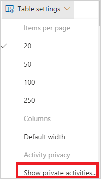

# Activity privacy

[!INCLUDE [Banner for top of topics](includes/banner.md)]

Microsoft Defender for Cloud Apps allows enterprises to granularly determine which users they want to monitor based on group membership. Activity privacy will enable you to follow your organization's compliance regulations without compromising user privacy. This is achieved by allowing you to monitor users while maintaining their privacy by hiding their activities in the activity log. Only authorized admins can choose to view these private activities, with each instance being audited in the governance log.

>[!NOTE]
> Private activities aren't forwarded to Microsoft Defender XDR Advanced hunting, and aren't passed on in our SIEM integration.

## Configure activity privacy user groups

You may have users in Defender for Cloud Apps that you want to monitor, but, due to compliance regulations, you need to limit the people who can do so. Activity privacy lets you define a user group for which the activities will be hidden by default.

To configure your user privacy groups, you must first [import user groups](user-groups.md) to Defender for Cloud Apps. By default, you'll see the following groups:

- **Application** user group -  A built-in group that enables you to see activities performed by Microsoft 365 and Azure AD applications.

- **External users** group - All users who aren't members of any managed domains you configured for your organization.

1. In the Microsoft Defender Portal, select **Settings**. Then choose **Cloud Apps**. Under **System**, select **Scoped deployment and privacy**.

1. To set specific groups to be monitored by Defender for Cloud Apps, in the **Activity privacy** tab, select **+Add group**.

1. In the **Add user groups** dialog, under **Select user groups**, select all the groups you want to make private in Defender for Cloud Apps, then select **Add**.

    

    > [!NOTE]
    > Once a user group is added, all the activities performed by users of the group will be made private from then on. Existing activities are not affected.

## Assign admins permission to view private activities

1. In the Microsoft Defender Portal, in the left-hand menu, select **Permissions**.
1. Under **Cloud Apps**, choose **Activity Privacy Permissions**.

    :::image type="content" source="media/activity-privacy-permissions.png" alt-text="Configure Activity Privacy Permissions.":::

1. To give specific admins permission to view private activities, in the **Activity privacy permissions** tab, select **+Add user**.

1. In the **Add admin permission** dialog, enter the admin's UPN or email address and select **Add permission**.

    

    > [!NOTE]
    > Only admins can be assigned permission to view private activities.

## Viewing private activities

Once an admin has been granted the appropriate permission to view private activities, they can choose to see these activities in the activity log.

### To view private activities

1. In the **Activity log** page, to the right of the activity table, select **Table settings**, and then select **Show private activities**.

    

1. In the **Show private activities** dialog, select **OK** to confirm that you understand that the action is being audited. Once confirmed, the private activities are shown in the activity log, and the action is recorded in the governance log.

> [!TIP]
> When you export activities with the **Show private activities** option selected, the activities inside the export are still private, and no activity details are exposed.
>  

[!INCLUDE [Open support ticket](includes/support.md)]
