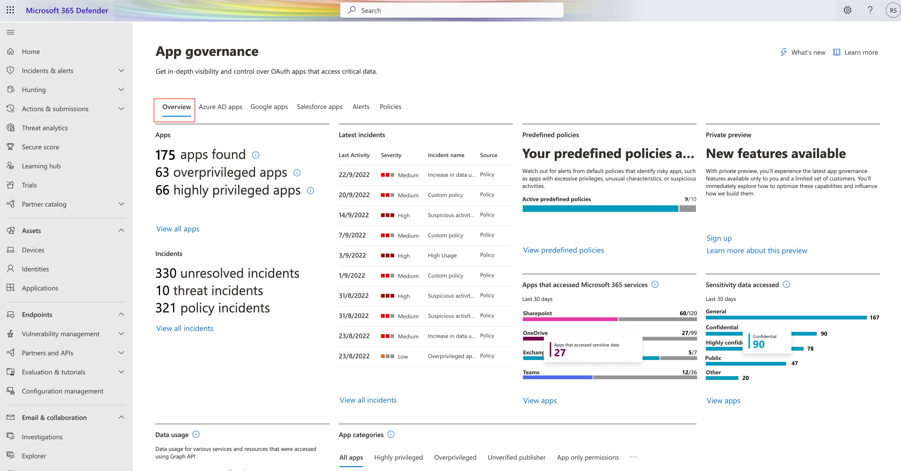

# Get started with visibility and insights

The first place to get started is the app governance dashboard at [https://aka.ms/appgovernance](https://aka.ms/appgovernance). Note that your sign-in account must have one of [these app governance administrator roles](app-governance-get-started.md#roles) to view any app governance data.
> [!div class="mx-imgBorder"]
>  
You can also access the app governance dashboard from **Office 365 > Microsoft 365 Defender > App governance > Overview page**.

## What’s available on the dashboard

The dashboard contains a summary of the components of the Microsoft 365 app ecosystem in the tenant:

- **Tenant summary**: The count of key app and incident categories.
- **Latest incidents**: The 10 most recent active incidents in the tenant
- **Data usage**: Mouse over each month column in the graph to see the corresponding value.
  - **Total data usage**: Tracks total data accessed by all apps in the tenant through Graph API over the last four calendar months. Currently includes emails, files, and chat and channel messages read and written by apps that access Microsoft 365 using Graph API.
  - **Data usage by resource type**: Data usage over the last four calendar months, broken down by resource type. Currently includes emails, files, and chat and channel messages read and written by apps that access Microsoft 365 using Graph API.
- **Apps that accessed data across Microsoft 365 services**: The count of apps that have accessed data with and without sensitivity labels on SharePoint, OneDrive, Exchange Online, and Teams in the last 30 days. For example, in the screenshot above, 99 apps accessed OneDrive in the last 30 days, out of which 27 apps accessed data with sensitivity labels.
- **Sensitivity labels accessed**: Count of apps that accessed labeled data across SharePoint, OneDrive, Exchange Online, and Teams in the last 30 days, sorted by the count. For example, in the screenshot above, 90 apps accessed confidential data on SharePoint, OneDrive, Exchange Online, and Teams.
- **Predefined policies**: Count of active and total predefined policies that identify risky apps, such as apps with excessive privileges, unusual characteristics, or suspicious activities.
- **App categories**: The top apps sorted by these categories:
  
  - **All categories**: Sorts across all available categories.
  - **Highly privileged**: High privilege is an internally determined category based on platform machine learning and signals.
  - **Overprivileged**: When app governance receives telemetry that indicates that a permission granted to an application hasn't been used in the last 90 days, that application is overprivileged. App governance must be operating for at least 90 days to determine if any app is overprivileged.  
  - **Unverified publisher**: Applications that haven't received [publisher certification](/azure/active-directory/develop/publisher-verification-overview) are considered unverified.
  - **App only permissions**: [Application permissions](/azure/active-directory/develop/v2-permissions-and-consent#permission-types) are used by apps that can run without a signed-in user present. Apps with permissions to access data across the tenant are potentially a higher risk.
  - **New apps**: New Microsoft 365 apps that have been registered in the last seven days.  

## View app insights

One of the primary value points for app governance is the ability to quickly view app alerts and insights. To view insights for your apps:

1. On your app governance portal page, select **Apps**.
1. You can view a specific selection of apps by applying one or more of the following default filter options:
    - API access
    - Privilege level
    - Permission usage
    - Permission type
    - Publisher type
1. You can also use one or more of the non-default filters to further customize your selection of apps by choosing any of these options:
    - Last modified
    - Added on
    - Certification
    - Users
    - Services accessed
    - Data usage
    - Sensitivity labels accessed

1. Select the name of an app to view details. Selecting an app name opens a detail pane on the right as shown in the following graphic:

    

    > [!NOTE]
    > The apps listed will depend on the apps present in your tenant.

Saving the query lets you save the defined list of filters in the current view. This could save time when selecting a subset of data in the future.

The details pane also lets you view the usage of the app over the past 30 days, the users who have consented to the app, and the permissions assigned to the app. An administrator could review the activity and permissions of an app that is generating alerts and make a decision to disable the app using the **Disable App** button in the Details pane.

## Next steps

[Get detailed insights on a specific app](app-governance-visibility-insights-view-apps.md).
