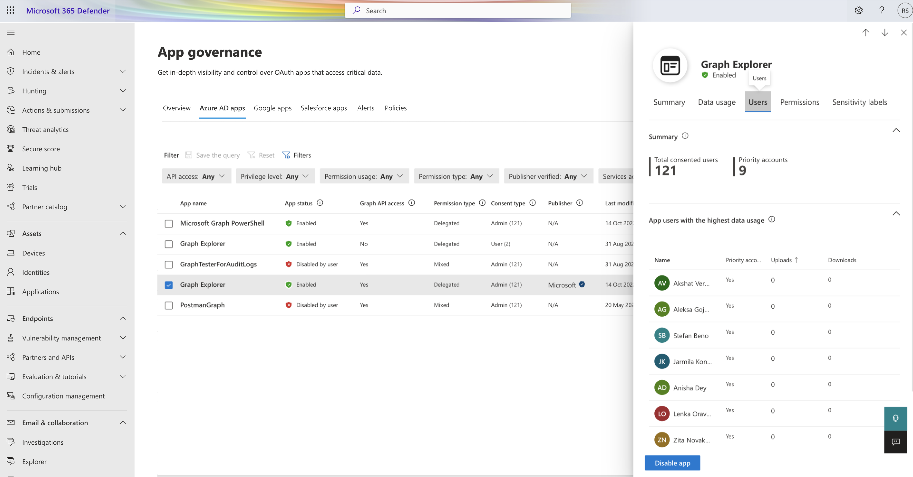
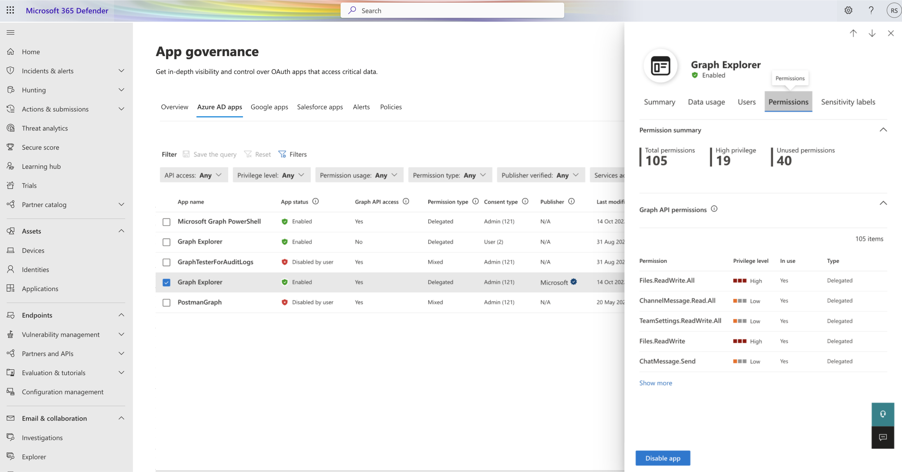
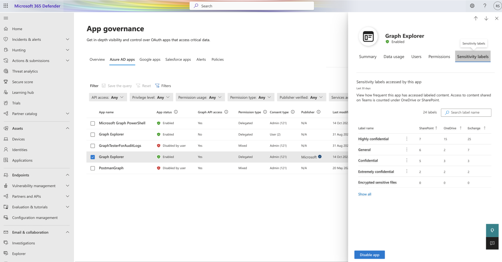

# View your apps

App governance allows you to quickly gain deep insights into the Microsoft 365 OAuth apps in your tenant. For example, you can see:

- A list of OAuth-enabled apps in the tenant, together with relevant app metadata and usage data.
- App details with deeper insights and information by selecting an app in the list.

## Getting a list of all the apps in your tenant

For a summary of apps in your tenant, go to **Microsoft 365 Defender > App governance > Apps**.

>[!NOTE]
> Your sign-in account must have one of [these roles](app-governance-get-started.md#roles) to view any app governance data.
>

You will see a list of apps and this information:

- App name
    The display name of the app as registered on Azure AD
- App status
    Shows whether the app is enabled or disabled, and if disabled by whom
- Graph API access
    Shows whether the app has at least one Graph API permission
- Permission type
    Shows whether the app has application (app only), delegated, or mixed permissions
- Consent type
    Shows whether the app consent has been given at the user or the admin level, and the number of users whose data is accessible to the app
- Publisher
    Publisher of the app and their verification status
- Last modified
    Date and time when registration information was last updated on Azure AD
- Added on

- Shows the date and time when the app was registered to Azure AD and assigned a service principal

- Permission usage
- Shows whether the app has any unused Graph API permissions in the last 90 days
- Data usage
- Total data downloaded or uploaded by the app in the last 30 days

- Privilege level
- Certification

- Indicates if an app meets stringent security and compliance standards set by Microsoft 365 or if its publisher has publicly attested to its safety

- App ID
- Sensitivity label accessed

  Sensitivity labels on content accessed by the app.
- Service accessed

  Microsoft 365 services accessed by the app

App governance sorts the app list alphabetically by **App name** by default. To sort the list by another app attribute, select the attribute name.

You can also select **Search** to search for an app by name.

## Getting detailed information on an app

For detailed information on a specific app in your tenant, go to **Microsoft 365 Defender > App governance > Apps > *app name***

> [!div class="mx-imgBorder"]
>

> [!div class="mx-imgBorder"]
>

> [!div class="mx-imgBorder"]
>

> [!div class="mx-imgBorder"]
>

> [!div class="mx-imgBorder"]
>

The app details pane provides additional information on these tabs:

| Tab name | Description |
|:-------|:-----|
|Summary| See additional data on the app such as the date first consented and the App ID. To see the properties of the app as registered in Azure AD, select **View app in Azure AD**. |
|Data usage |See the data usage by the app in the tenant and plot the data usage for Exchange, SharePoint, OneDrive, and Teams resources. You can filter usage insights by priority accounts only. |
|Users |See a list of users who are using the app, whether they're a priority account, and the amount of data downloaded and uploaded. If an app is admin consented, the Total consented users will be all users in the tenant. |
|Permissions | See a summary and list of the Graph API and legacy permissions granted to the app, consent type, and whether they are in use. For more information, see the [Microsoft Graph permissions reference](/graph/permissions-reference). |
|Sensitive labels | See how frequent items with certain sensitivity labels were accessed by the app on Microsoft 365. |

For an enabled app, there's also a **Disable app** control to disable the use of the selected app and an **Enable app** control to enable the use of the disabled app. These actions require these administrator roles:

- Compliance Administrator
- Global or Company Administrator
- Security Administrator
- Security Operator

## Next step

[Determine your overall app compliance posture](app-governance-visibility-insights-compliance-posture.md).
