# Classic portal: Deploy Conditional Access App Control for any web app using PingOne as the identity provider (IdP)

[!INCLUDE [Banner for top of topics](includes/banner.md)]

You can configure session controls in Microsoft Defender for Cloud Apps to work with any web app and any non-Microsoft IdP. This article describes how to route app sessions from PingOne to Defender for Cloud Apps for real-time session controls.

For this article, we'll use the Salesforce app as an example of a web app being configured to use Defender for Cloud Apps session controls. To configure other apps, perform the same steps according to their requirements.

## Prerequisites

- Your organization must have the following licenses to use Conditional Access App Control:

  - A relevant PingOne license (required for single sign-on)
  - Microsoft Defender for Cloud Apps

- An existing PingOne single sign-on configuration for the app using the SAML 2.0 authentication protocol

## To configure session controls for your app using PingOne as the IdP

Use the following steps to route your web app sessions from PingOne to Defender for Cloud Apps. For Microsoft Entra configuration steps, see [Onboard and deploy Conditional Access App Control for custom apps using Microsoft Entra ID](proxy-deployment-any-app.md).

> [!NOTE]
> You can configure the app's SAML single sign-on information provided by PingOne using one of the following methods:
>
> - **Option 1**: Uploading the app's SAML metadata file.
> - **Option 2**: Manually providing the app's SAML data.
>
> In the following steps, we'll use option 2.

**Step 1: [Get your app's SAML single sign-on settings](#idp1-get-your-app-saml-sso-info)**

**Step 2: [Configure Defender for Cloud Apps with your app's SAML information](#idp1-conf-cas-with-your-app-saml-info)**

**Step 3: [Create a custom app in PingOne](#idp1-create-custom-app-pingone)**

**Step 4: [Configure Defender for Cloud Apps with the PingOne app's information](#idp1-conf-cas-with-pingone-app-info)**

**Step 5: [Complete the custom app in PingOne](#idp1-complete-custom-app-in-pingone)**

**Step 6: [Get the app changes in Defender for Cloud Apps](#idp1-get-app-changes-in-cas)**

**Step 7: [Complete the app changes](#idp1-complete-app-changes)**

**Step 8: [Complete the configuration in Defender for Cloud Apps](#idp1-complete-conf-in-cas)**

## Step 1: Get your app's SAML single sign-on settings

1. In Salesforce, browse to **Setup** > **Settings** > **Identity** > **Single Sign-On Settings**.

1. Under **Single Sign-On Settings**, select the name of your existing SAML 2.0 configuration.

    

1. On the **SAML Single Sign-On Setting** page, make a note of the Salesforce **Login URL**. You'll need this later.

    > [!NOTE]
    > If your app provides a SAML certificate, download the certificate file.

    

## Step 2: Configure Defender for Cloud Apps with your app's SAML information

1. In Defender for Cloud Apps, browse to **Investigate** > **Connected apps** > **Conditional Access App Control apps**.

1. Select plus sign (**+**), and in the pop-up, select the app you want to deploy, and then select **Start Wizard**.
1. On the **APP INFORMATION** page, select **Fill in data manually**, in the **Assertion consumer service URL** enter the Salesforce **Login URL** you noted earlier, and then select **Next**.

    > [!NOTE]
    > If your app provides a SAML certificate, select **Use <app_name> SAML certificate** and upload the certificate file.

    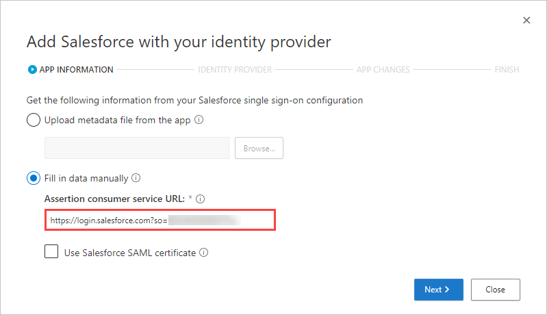

## Step 3: Create a custom app in PingOne

Before you proceed, use the following steps to get information from your existing Salesforce app.

1. In PingOne, edit your existing Salesforce app.

1. On the **SSO Attribute Mapping** page, make a note of the SAML_SUBJECT attribute and value, and then download the **Signing Certificate** and **SAML Metadata** files.

    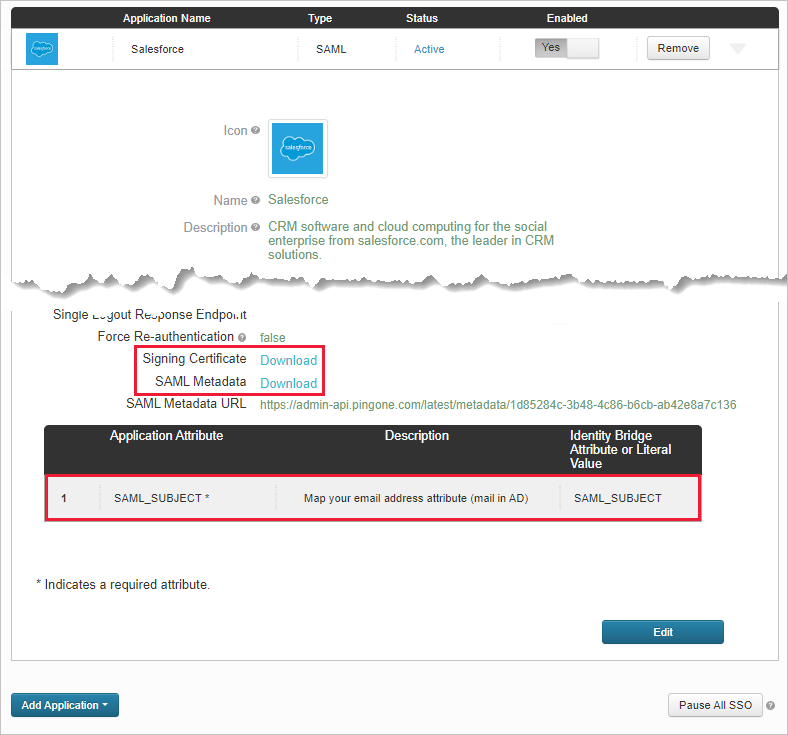

1. Open the SAML metadata file and make a note of the PingOne **SingleSignOnService Location**. You'll need this later.

    

1. On the **Group Access** page, make a note of the assigned groups.

    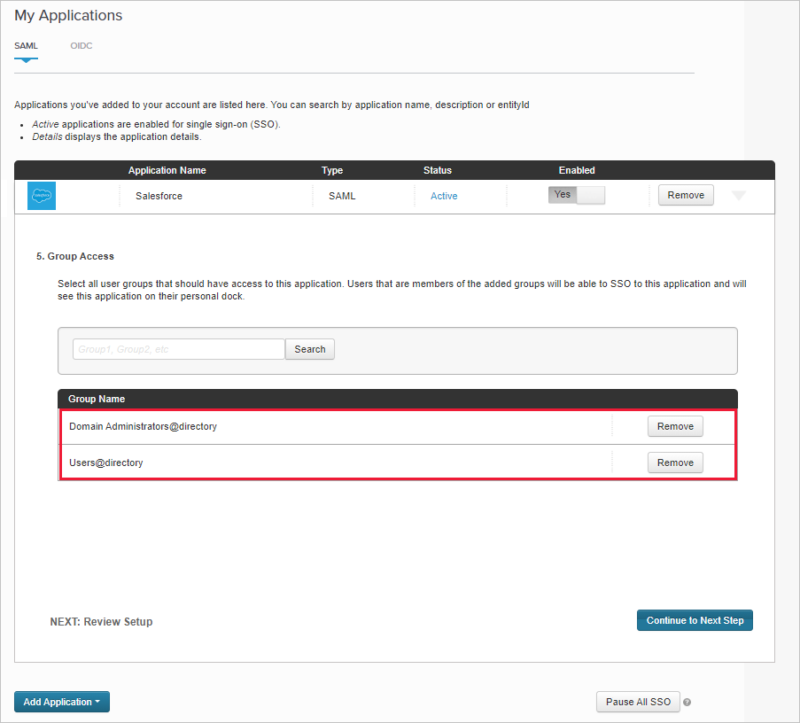

Then use the instructions from the **Add a SAML application with your identity provider** page to configure a custom app in your IdP's portal.

> [!NOTE]
> Configuring a custom app enables you to test the existing app with access and session controls without changing the current behavior for your organization.

1. Create a **New SAML Application**.

    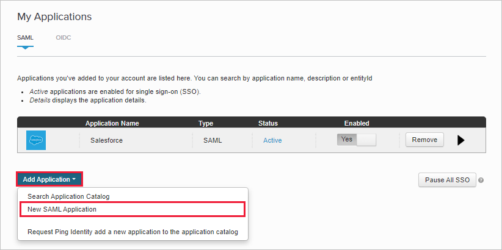

1. On the **Application Details** page, fill out the form, and then select **Continue to Next Step**.

    > [!TIP]
    > Use an app name that will help you to differentiate between the custom app and the existing Salesforce app.

    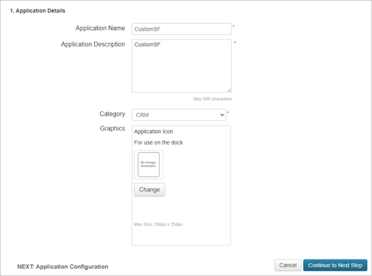

1. On the **Application Configuration** page, do the following, and then select **Continue to Next Step**.
    - In the **Assertion Consumer Service (ACS)** field, enter the Salesforce **Login URL** you noted earlier.
    - In the **Entity ID** field, enter a unique ID starting with `https://`. Make sure this is different from the exiting Salesforce PingOne app's configuration.
    - Make a note of the **Entity ID**. You'll need this later.

    

1. On the **SSO Attribute Mapping** page, add the existing Salesforce app's **SAML_SUBJECT** attribute and value you noted earlier, and then select **Continue to Next Step**.

    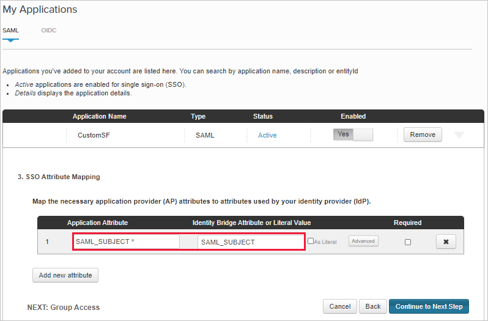

1. On the **Group Access** page, add the existing Salesforce app's groups you noted earlier, and complete the configuration.

    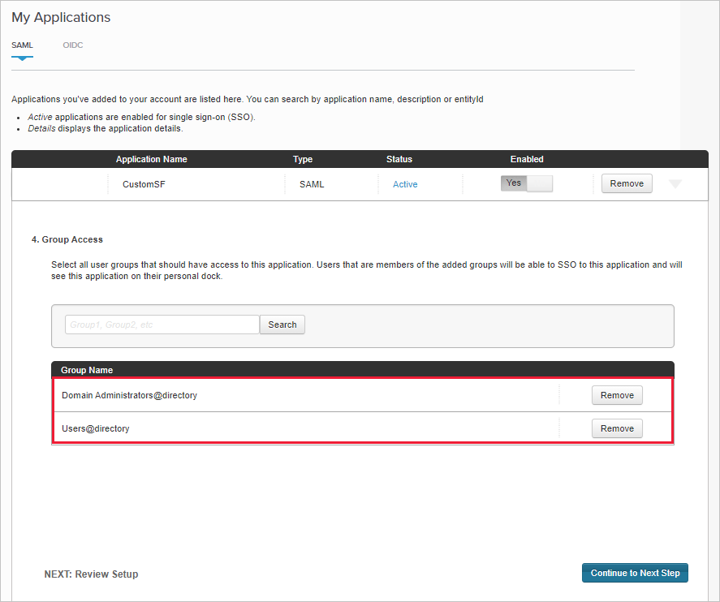

## Step 4: Configure Defender for Cloud Apps with the PingOne app's information

1. Back in the Defender for Cloud Apps **IDENTITY PROVIDER** page, select **Next** to proceed.

1. On the next page, select **Fill in data manually**, do the following, and then select **Next**.
    - For the **Assertion consumer service URL**, enter the Salesforce **Login URL** you noted earlier.
    - Select **Upload identity provider's SAML certificate** and upload the certificate file you downloaded earlier.

    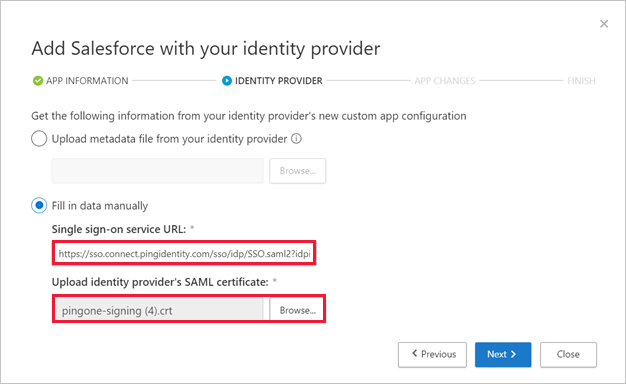

1. On the next page, make a note of the following information, and then select **Next**. You'll need the information later.

    - Defender for Cloud Apps single sign-on URL
    - Defender for Cloud Apps attributes and values

    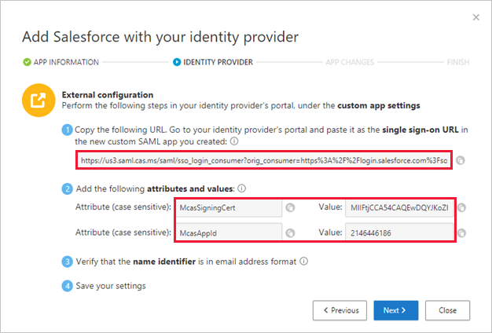

## Step 5: Complete the custom app in PingOne

1. In PingOne, locate and edit the custom Salesforce app.

    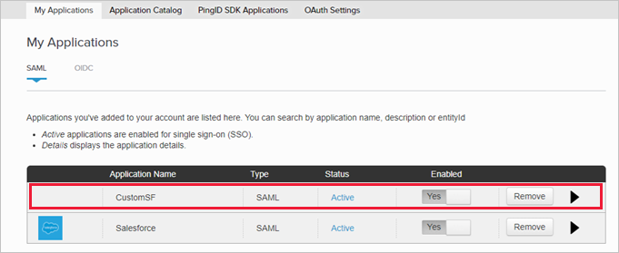

1. In the **Assertion Consumer Service (ACS)** field, replace the URL with the Defender for Cloud Apps single sign-on URL you noted earlier, and then select **Next**.

    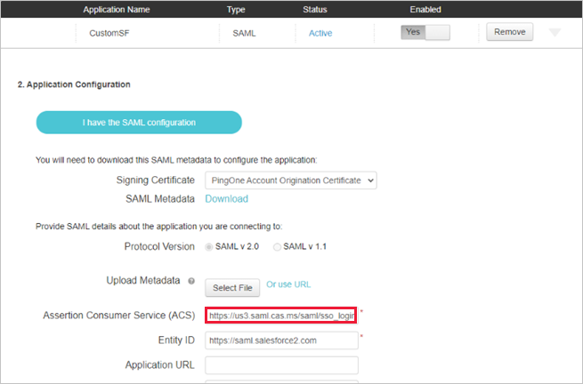

1. Add the Defender for Cloud Apps attributes and values you noted earlier to the app's properties.

    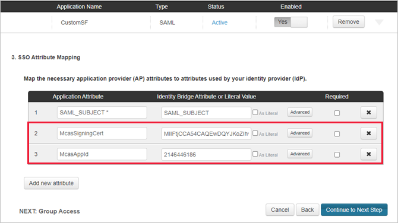

1. Save your settings.

## Step 6: Get the app changes in Defender for Cloud Apps

Back in the Defender for Cloud Apps **APP CHANGES** page, do the following, but **don't select Finish**. You'll need the information later.

- Copy the Defender for Cloud Apps SAML Single sign-on URL
- Download the Defender for Cloud Apps SAML certificate

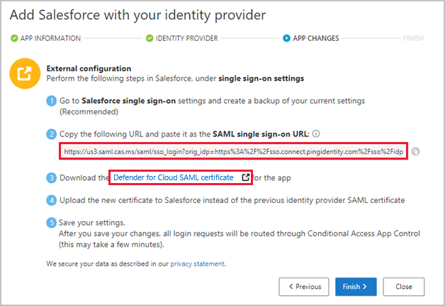

## Step 7: Complete the app changes

In Salesforce, browse to **Setup** > **Settings** > **Identity** > **Single Sign-On Settings**, and do the following:

1. Recommended: Create a backup of your current settings.
1. Replace the **Identity Provider Login URL** field value with the Defender for Cloud Apps SAML single sign-on URL you noted earlier.
1. Upload the Defender for Cloud Apps SAML certificate you downloaded earlier.
1. Replace the **Entity ID** field value with the PingOne custom app Entity ID you noted earlier.
1. Select **Save**.

    > [!NOTE]
    > The Defender for Cloud Apps SAML certificate is valid for one year. After it expires, a new certificate will need to be generated.

    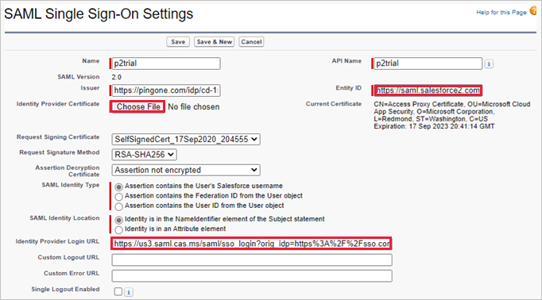

## Step 8: Complete the configuration in Defender for Cloud Apps

- Back in the Defender for Cloud Apps **APP CHANGES** page, select **Finish**. After completing the wizard, all associated login requests to this app will be routed through Conditional Access App Control.

## Next steps

> [!div class="nextstepaction"]
> [« PREVIOUS: Deploy Conditional Access App Control for any apps](proxy-deployment-any-app.md)

## See also

> [!div class="nextstepaction"]
> [Introduction to Conditional Access App Control](proxy-intro-aad.md)

> [!div class="nextstepaction"]
> [Troubleshooting access and session controls](troubleshooting-proxy.md)

[!INCLUDE [Open support ticket](includes/support.md)]
