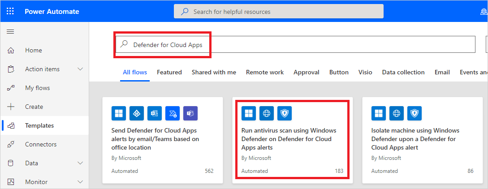
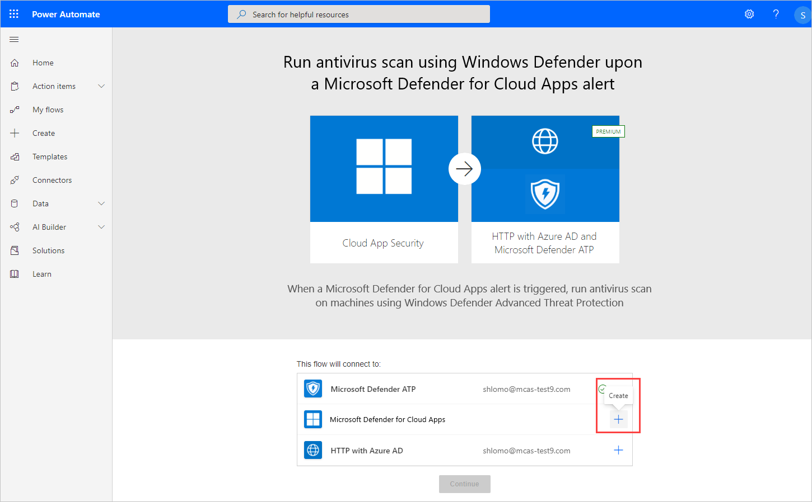
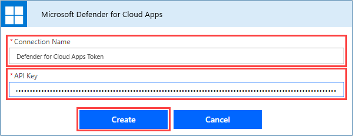
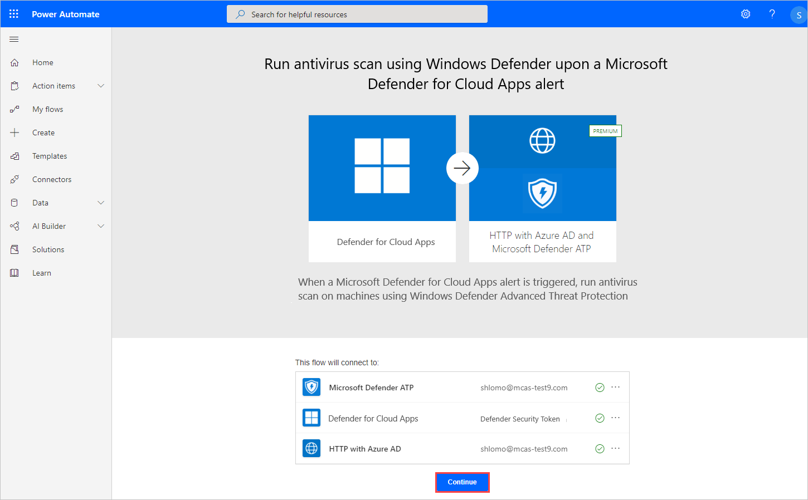

# Classic portal: Tutorial: Extend governance to endpoint remediation

[!INCLUDE [Banner for top of topics](includes/banner.md)]

Defender for Cloud Apps provides predefined governance options for policies, such as suspend a user or make a file private. Using the native integration with Microsoft Power Automate, you can use a large ecosystem of software as a service (SaaS) connectors to build workflows to automate processes including remediation.

For example, when detecting a possible malware threat, you can use workflows to start Microsoft Defender for Endpoint remediation actions such as running an antivirus scan or isolating an endpoint.

In this tutorial, you'll learn how to configure a policy governance action to use a workflow to run an antivirus scan on an endpoint where a user shows signs of suspicious behavior:

> [!div class="checklist"]
>
> - 1: [Generate a Defender for Cloud Apps API token](#generate-token)
> - 2: [Create a flow to run an antivirus scan](#create-flow)
> - 3: [Configure the flow](#configure-flow)
> - 4: [Configure a policy to run the flow](#configure-policy)

> [!NOTE]
> These workflows are only relevant for policies that contains user activity. For example, you can't use these workflows with Discovery or OAuth policies.

If you don't have a Power Automate plan, [sign up for a free trial account](https://flow.microsoft.com/pricing/).

## Prerequisites

- You must have a valid [Microsoft Power Automate plan](https://flow.microsoft.com/pricing/)
- You must have a valid Microsoft Defender for Endpoint plan
- The Power Automate environment must be Microsoft Entra ID synced, Defender for Endpoint monitored, and domain-joined

## Phase 1: Generate a Defender for Cloud Apps API token

> [!NOTE]
> If you have previously created a workflow using a Defender for Cloud Apps connector, Power Automate automatically reuses the token and you can skip this step.

1. In Defender for Cloud Apps, in the menu bar, select the settings cog  and select **Security extensions**.

1. On the **Security extensions** page, select the plus button to generate a new API token.
1. In the **Generate new token** pop-up, enter the token name (for example, "Flow-Token"), and then select **Generate**.

    
1. Once the token is generated, select the copy icon to the right of the generated token, and then select **Close**. You'll need the token later.

    

## Phase 2: Create a flow to run an antivirus scan

> [!NOTE]
> If you have previously created a flow using a Defender for Endpoint connector, Power Automate automatically reuses the connector and you can skip the **Sign in** step.

1. Go to the [Power Automate portal](https://flow.microsoft.com/) and select **Templates**.

    

1. Search for *Defender for Cloud Apps* and select **Run antivirus scan using Windows Defender on Defender for Cloud Apps alerts**.

    

1. In the list of apps, on the row in which **Microsoft Defender for Endpoint connector** appears, select **Sign in**.

    

## Phase 3: Configure the flow

> [!NOTE]
> If you have previously created a flow using a Microsoft Entra connector, Power Automate automatically reuses the token and you can skip this step.

1. In the list of apps, on the row in which **Defender for Cloud Apps** appears, select **Create**.

    

1. In the **Defender for Cloud Apps** pop-up, enter the connection name (for example, "Defender for Cloud Apps Token"), paste the API token you copied, and then select **Create**.

    

1. In the list of apps, on the row in which **HTTP with Azure AD** appears, select **Sign in**.

1. In the **HTTP with Azure AD** pop-up, for both the **Base Resource URL** and **Azure AD Resource URI** fields, enter `https://graph.microsoft.com`, and then select **Sign in** and enter the admin credentials you want to use with the HTTP with Azure AD connector.

    

1. Select **Continue**.

    

1. Once all the connecters are successfully connected, on the flow's page under **Apply to each device**, optionally modify the comment and scan type, and then select **Save**.

    

## Phase 4: Configure a policy to run the flow

1. In Defender for Cloud Apps, select **Control**, and then select **Policies**.

1. In the list of policies, on the row where the relevant policy appears, choose the three dots at the end of the row, and then choose **Edit policy**.

1. Under **Alerts**, select **Send alerts to Flow**, and then select **Run antivirus scan using Windows Defender upon a Defender for Cloud Apps alert**.

    

Now every alert raised for this policy will initiate the flow to run the antivirus scan.

You can use the steps in this tutorial to create a wide range of workflow-based actions to extend Defender for Cloud Apps remediation capabilities, including other Defender for Endpoint actions. To see a list of predefined Defender for Cloud Apps workflows, in Power Automate, [search for "Defender for Cloud Apps"](https://go.microsoft.com/fwlink/?linkid=2102574).

## See also

> [!div class="nextstepaction"]
> [Integrate with Power Automate for custom alert automation](flow-integration.md)
