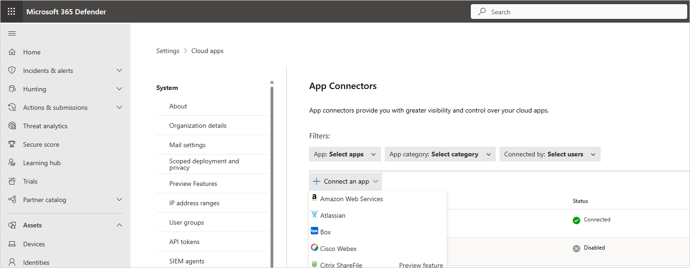
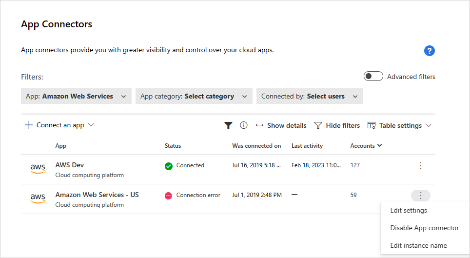

# Connect Amazon Web Services  to Microsoft Defender for Cloud Apps

[!INCLUDE [Banner for top of topics](includes/banner.md)]

This article provides instructions for connecting your existing Amazon Web Services (AWS) account to Microsoft Defender for Cloud Apps using the connector APIs. For information about how Defender for Cloud Apps protects AWS, see [Protect AWS](protect-aws.md).

You can connect AWS **Security auditing** to Defender for Cloud Apps connections to gain visibility into and control over AWS app use.

## How to connect AWS Security auditing to Defender for Cloud Apps

Use the following steps to configure your AWS auditing and then connect it to Defender for Cloud Apps.

### Step 1: Configure Amazon Web Services auditing

1. In your [Amazon Web Services console](https://aws.amazon.com/console/), under **Security, Identity & Compliance**, select **IAM**.

    

1. Select **Users** and then select **Add user**.

    

1. In the **Details** step, provide a new user name for Defender for Cloud Apps. Make sure that under **Access type** you select **Programmatic access** and select **Next Permissions**.<a name="set-permissions"></a>

    

1. Select **Attach existing policies directly**, and then **Create policy**.

    

1. Select the **JSON** tab:

    

1. Paste the following script into the provided area:

    ```json
    {
      "Version" : "2012-10-17",
      "Statement" : [{
          "Action" : [
            "cloudtrail:DescribeTrails",
            "cloudtrail:LookupEvents",
            "cloudtrail:GetTrailStatus",
            "cloudwatch:Describe*",
            "cloudwatch:Get*",
            "cloudwatch:List*",
            "iam:List*",
            "iam:Get*",
            "s3:ListAllMyBuckets",
            "s3:PutBucketAcl",
            "s3:GetBucketAcl",
            "s3:GetBucketLocation"
          ],
          "Effect" : "Allow",
          "Resource" : "*"
        }
      ]
     }
    ```

1. Select **Next: Tags**

     

1. Select **Next: Review**.

    

1. Provide a **Name** and select **Create policy**.

    

1. Back in the **Add user** screen, refresh the list if necessary, and select the user you created, and select **Next: Tags**.

    

1. Select **Next: Review**.

1. If all the details are correct, select **Create user**.

    

1. When you get the success message, select **Download .csv** to save a copy of the new user's credentials. You'll need these later.

    

    > [!NOTE]
    > After connecting AWS, you'll receive events for seven days prior to connection. If you just enabled CloudTrail, you'll receive events from the time you enabled CloudTrail.

### Step 2: Connect Amazon Web Services auditing to Defender for Cloud Apps

1. In the Microsoft 365 Defender portal, select **Settings**. Then choose **Cloud Apps**. Under **Connected apps**, select **App Connectors**.

1. In the **App connectors** page, to provide the AWS connector credentials, do one of the following:

    **For a new connector**  

    1. Select the **+Connect an app**, followed by **Amazon Web Services**.

        

    1. In the next window, provide a name for the connector, and then select **Next**.

        

    1. On the **Connect Amazon Web Services** page, select **Security auditing**, and then select **Next**.

    1. On the **Security auditing page**, paste the **Access key** and **Secret key** from the .csv file into the relevant fields, and select **Next**.

        

    **For an existing connector**

    1. In the list of connectors, on the row in which the AWS connector appears, select **Edit settings**.

        

    1. On the **Instance name** and **Connect Amazon Web Services** pages, select **Next**. On the **Security auditing page**, paste the **Access key** and **Secret key** from the .csv file into the relevant fields, and select **Next**.

        

1. In the Microsoft 365 Defender portal, select **Settings**. Then choose **Cloud Apps**. Under **Connected apps**, select **App Connectors**. Make sure the status of the connected App Connector is **Connected**.

## Next steps

> [!div class="nextstepaction"]
> [Control cloud apps with policies](control-cloud-apps-with-policies.md)

[!INCLUDE [Open support ticket](includes/support.md)]
