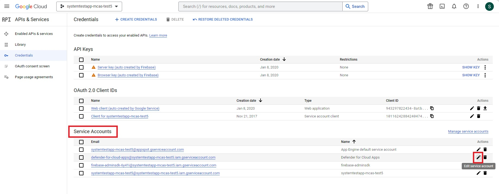
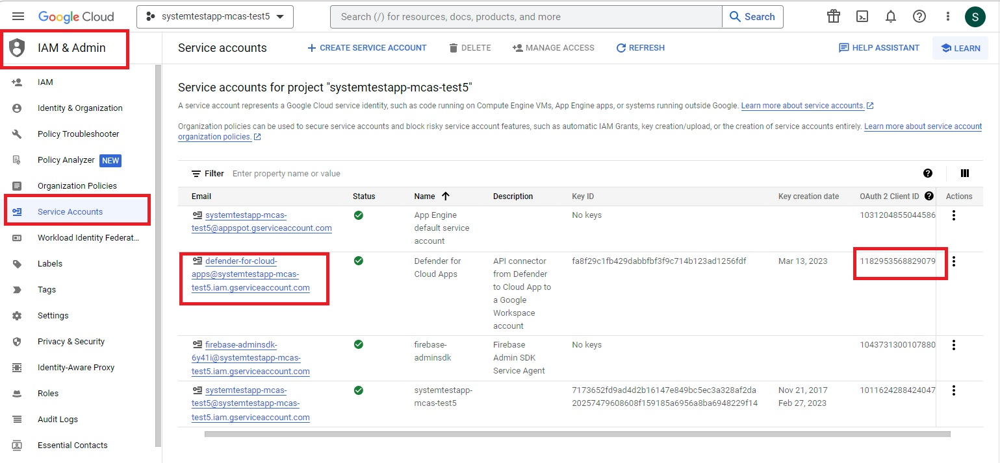

# Connect Google Workspace to Microsoft Defender for Cloud Apps

[!INCLUDE [Banner for top of topics](includes/banner.md)]

This article provides instructions for connecting Microsoft Defender for Cloud Apps to your existing Google Workspace account using the connector APIs. This connection gives you visibility into and control over Google Workspace use. For information about how Defender for Cloud Apps protects Google Workspace, see [Protect Google Workspace](protect-google-workspace.md).

> [!NOTE]
> File download activities for Google Workspace aren't displayed in Defender for Cloud Apps.


## Configure Google Workspace

1. As a Google Workspace Super Admin, sign in to <https://console.cloud.google.com>.

1. Select the project dropdown in the top ribbon and then select **New Project** to start a new project.

   

1. In the **New project** page, name your project as follows: **Defender for Cloud Apps** and select **Create**.

   

1. After the project is created, select the created project from the top ribbon. Copy the **Project number**, you'll need it later.
   
   

1. In the navigation menu, go to **APIs & Services** > **Library**.
    Enable the following APIs (use the search bar if the API isn't listed):

    - Admin SDK API
    - Google Drive API
   
1. In the navigation menu, go to **APIs & Services** > **Credentials** and do the following steps:
   
   1. Select **CREATE CREDENTIALS**. 
   
       

   
   1. Select **Service Account**.


   1. **Service account details**: Provide the name as *Defender for Cloud Apps* and description as *API connector from Defender for Cloud Apps to a Google workspace account*. 
   
       

   
   1. Select **CREATE AND CONTINUE**.
   
   1. Under **Grant this service account access to project**, for **Role** select **Project > Editor**, and then select **Done**.
   
       

   
   1. In the navigation menu, return to **APIs & Services** > **Credentials**. 
   
   1. Under **Service Accounts**, locate and edit the service account you created earlier by selecting the pencil icon.
   
       

   
   1. Copy the email address. You'll need it later.
   
   1. Navigate to **KEYS** from the top ribbon. 
   
       

   
   1. From the **ADD KEY** menu, select **Create new key**. 
   
   1. Select **P12**, and then select **CREATE**. Save the downloaded file and the password required to use the file. 
   
       

   
1.  In the navigation menu, go to **IAM & Admin** > **Service accounts**. Copy the **Client ID** assigned to the service account you have just created - you'll need it later.
   
     

   
1. Go to [admin.google.com](https://admin.google.com/) and in the navigation menu, go to **Security** > **Access and data control** > **API Controls**. Then do the following:

1. Under **Domain wide delegation**, select **MANAGE DOMAIN WIDE DELEGATION**.

   

1. Select **Add new**.
   
  1. In the **Client ID** box, enter the **Client ID** that you copied earlier.
  1. In the **OAuth Scopes** box, enter the following list of required scopes (copy the text and paste it in the box):

      ```txt
      https://www.googleapis.com/auth/admin.reports.audit.readonly,https://www.googleapis.com/auth/admin.reports.usage.readonly,https://www.googleapis.com/auth/drive,https://www.googleapis.com/auth/drive.appdata,https://www.googleapis.com/auth/drive.apps.readonly,https://www.googleapis.com/auth/drive.file,https://www.googleapis.com/auth/drive.metadata.readonly,https://www.googleapis.com/auth/drive.readonly,https://www.googleapis.com/auth/drive.scripts,https://www.googleapis.com/auth/admin.directory.user.readonly,https://www.googleapis.com/auth/admin.directory.user.security,https://www.googleapis.com/auth/admin.directory.user.alias,https://www.googleapis.com/auth/admin.directory.orgunit,https://www.googleapis.com/auth/admin.directory.notifications,https://www.googleapis.com/auth/admin.directory.group.member,https://www.googleapis.com/auth/admin.directory.group,https://www.googleapis.com/auth/admin.directory.device.mobile.action,https://www.googleapis.com/auth/admin.directory.device.mobile,https://www.googleapis.com/auth/admin.directory.user
      ```

1. Select **AUTHORIZE**. 

  

   
## Configure Defender for Cloud Apps

1. In the [Defender for Cloud Apps portal](https://portal.cloudappsecurity.com/), select **Investigate** and then **Connected apps**.

1. To provide the Google Workspace connection details, under **App connectors**, do one of the following:

    **For a Google Workspace organization that already has a connected GCP instance**

    - In the list of connectors, at the end of row in which the GCP instance appears, select the three dots and then select **Add Google Workspace**.

    **For a Google Workspace organization that does not already have a connected GCP instance**

    - In the **Connected apps** page, select the plus sign (**+**) and select **Google Workspace**.

1. In the pop-up, fill in the following information:

    

    1. Enter the **Service account ID**, the **Email** that you copied earlier.

    1. Enter the **Project number (App ID)** that you copied earlier.

    1. Upload the P12 **Certificate** file that you saved earlier.

    1. Enter one **admin account email** of your Google Workspace admin.

    1. If you have a Google Workspace Business or Enterprise account, check this check box. For information about which features are available in Defender for Cloud Apps for Google Workspace Business or Enterprise, see [Enable instant visibility, protection, and governance actions for your apps](enable-instant-visibility-protection-and-governance-actions-for-your-apps.md).

    1. Select **Save settings**.

    1. Make sure the connection succeeded by selecting **Test now**.  
    Testing may take a couple of minutes.  
    After receiving a success notice, select **Done** and close the Google Workspace page.

After connecting Google Workspace, you'll receive events for seven days prior to connection.

After connecting Google Workspace, Defender for Cloud Apps performs a full scan. Depending on how many files and users you have, completing the full scan can take a while. To enable near real-time scanning, files on which activity is detected are moved to the beginning of the scan queue. For example, a file that is edited, updated, or shared is scanned right away. This doesn't apply to files that aren't inherently modified. For example, files that are viewed, previewed, printed, or exported are scanned during the regular scan.

If you have any problems connecting the app, see [Troubleshooting App Connectors](troubleshooting-api-connectors-using-error-messages.md).

## Next steps

> [!div class="nextstepaction"]
> [Control cloud apps with policies](control-cloud-apps-with-policies.md)

[!INCLUDE [Open support ticket](includes/support.md)]


