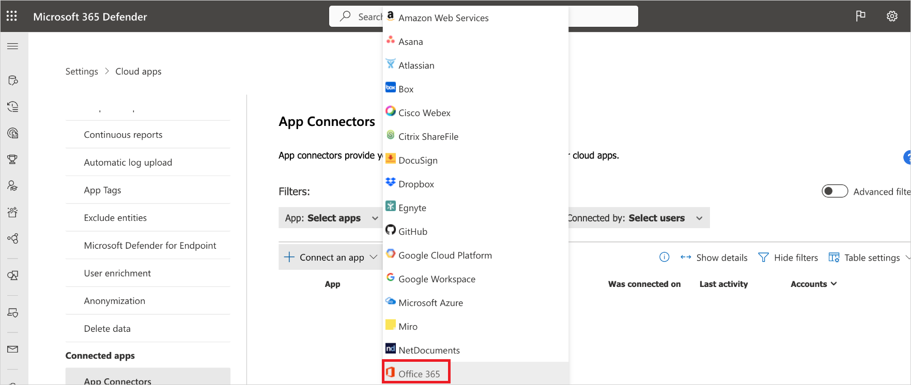

# Connect Office 365 to Microsoft Defender for Cloud Apps

[!INCLUDE [Banner for top of topics](includes/banner.md)]

This article provides instructions for connecting Microsoft Defender for Cloud Apps to your existing Office 365 account using the app connector API. This connection gives you visibility into and control over Office 365 use. For information about how Defender for Cloud Apps protects Office 365, see [Protect Office 365](protect-office-365.md).
  
Defender for Cloud Apps supports the legacy Office 365 Dedicated Platform as well as the latest offerings of Office 365 services (commonly referred as the vNext release family of Office 365).  

> [!NOTE]
> In some cases, a vNext service release differs slightly at the administrative and management levels from the standard Office 365 offering.

Defender for Cloud Apps integrates directly with [Office 365's audit logs](/microsoft-365/compliance/detailed-properties-in-the-office-365-audit-log?view=o365-worldwide&preserve-view=true) and receives all audited events from all supported services. For a list of supported services, see [Microsoft 365 services that support auditing](/microsoft-365/compliance/search-the-audit-log-in-security-and-compliance#microsoft-365-services-that-support-auditing).

## How to connect Office 365 to Defender for Cloud Apps

> [!NOTE]
>
>- You must have at least one assigned Office 365 license to connect Office 365 to Defender for Cloud Apps.
>- To enable monitoring of Office 365 activities in Defender for Cloud Apps, you are required to enable auditing in the [Microsoft Purview compliance portal](/microsoft-365/compliance/turn-audit-log-search-on-or-off).
>- Exchange administrator audit logging, which is enabled by default in Office 365, logs an event in the Office 365 audit log when an administrator (or a user who has been assigned administrative privileges) makes a change in your Exchange Online organization. Changes made using the Exchange admin center or by running a cmdlet in Windows PowerShell are logged in the Exchange admin audit log. For more detailed information about admin audit logging in Exchange, see [Administrator audit logging](/exchange/security-and-compliance/exchange-auditing-reports/view-administrator-audit-log).
>- Exchange Mailbox audit logging must be turned on for each user mailbox before user activity in Exchange Online is logged, see [Exchange Mailbox activities](https://support.office.com/article/Search-the-audit-log-in-the-Office-365-Security-Compliance-Center-0d4d0f35-390b-4518-800e-0c7ec95e946c).
>- If Office apps are enabled, groups that are part of Office 365 are also imported to Defender for Cloud Apps from the specific Office apps, for example, if SharePoint is enabled, Office 365 groups are imported as SharePoint groups as well.
>- You must [enable auditing in Power BI](/power-bi/admin/service-admin-auditing) to get the logs from there. Once auditing is enabled, Defender for Cloud Apps starts getting the logs (with a delay of 24-72 hours).
>- You must [enable auditing in Dynamics 365](/power-platform/admin/enable-use-comprehensive-auditing#enable-auditing) to get the logs from there. Once auditing is enabled, Defender for Cloud Apps starts getting the logs (with a delay of 24-72 hours).
>- If your Azure Active Directory is set to automatically sync with the users in your Active Directory on-premises environment the settings in the on-premises environment override the Azure AD settings and use of the **Suspend user** governance action is reverted.
>- For Azure AD sign-in activities, Defender for Cloud Apps only surfaces interactive sign-in activities and sign-in activities from legacy protocols such as ActiveSync. Noninteractive sign-in activities may be viewed in the Azure AD audit log.
>- [Multi-geo deployments](/microsoft-365/enterprise/microsoft-365-multi-geo) are only supported for OneDrive
>- In SharePoint and OneDrive, Defender for Cloud Apps supports user quarantine only for files in **Shared Documents** libraries (SharePoint Online) and files in the **Documents** library (OneDrive for Business).
>- In SharePoint, Defender for Cloud Apps supports quarantine tasks only for files with **Shared Documents** in path in English.
> - Events from **Exchange**, **Power BI**, and **Teams** will only appear after activities from those services are detected in the portal.

1. In the Microsoft 365 Defender portal, select **Settings**. Then choose **Cloud Apps**. Under **Connected apps**, select **App Connectors**.
1. In the **App connectors** page, select **+Connect an app**, and then select **Office 365**.

    

1. In the **Select Office 365 components** page, select the options you require, and then select **Connect**.

    > [!NOTE]
    >
    > - For best protection, we recommend selecting all Office 365 components.
    > - The **Azure AD files** component, requires the **Azure AD activities** component and Defender for Cloud Apps file monitoring (**Settings** > **Cloud Apps** > **Files** > **Enable file monitoring**).

    

1. On the **Follow the link** page, select **Connect Office 365**.

1. After Office 365 is displayed as successfully connected, select **Done**.

> [!NOTE]
> After connecting Office 365, you will see data from a week back including any third-party applications connected to Office 365 that are pulling APIs. For third-party apps that weren't pulling APIs prior to connection, you see events from the moment you connect Office 365 because Defender for Cloud Apps turns on any APIs that had been off by default.

If you have any problems connecting the app, see [Troubleshooting App Connectors](troubleshooting-api-connectors-using-error-messages.md).

## Next steps

> [!div class="nextstepaction"]
> [Control cloud apps with policies](control-cloud-apps-with-policies.md)

[!INCLUDE [Open support ticket](includes/support.md)]
