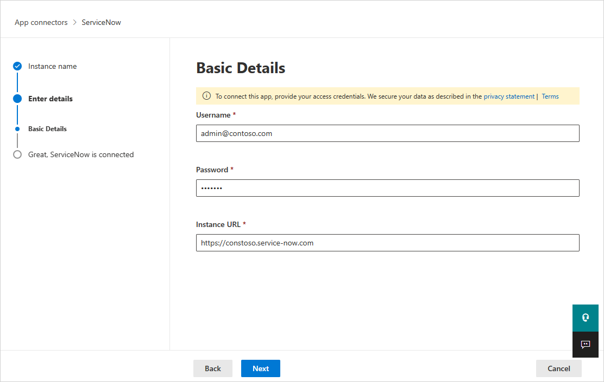

# Connect ServiceNow to Microsoft Defender for Cloud Apps

[!INCLUDE [Banner for top of topics](includes/banner.md)]

This article provides instructions for connecting Microsoft Defender for Cloud Apps to your existing ServiceNow account using the app connector API. This connection gives you visibility into and control over ServiceNow use. For information about how Defender for Cloud Apps protects ServiceNow, see [Protect ServiceNow](protect-servicenow.md).

[!INCLUDE [security-posture-management-connector](includes/security-posture-management-connector.md)]

## Prerequisites

Defender for Cloud Apps supports the following ServiceNow versions:

:::row:::
    :::column:::
        - Eureka
        - Fiji
        - Geneva
        - Helsinki
        - Istanbul
        - Jakarta
        - Kingston
        - London  
        - Utah
    :::column-end:::
    :::column:::
        - Madrid
        - New York
        - Orlando
        - Paris
        - Quebec
        - Rome
        - San Diego
        - Tokyo    
    :::column-end:::
:::row-end:::

In order to connect ServiceNow with Defender for Cloud Apps, you must have the **Admin** role and make sure the ServiceNow instance supports API access. 

For more information, see the [ServiceNow product documentation](https://docs.servicenow.com/bundle/paris-platform-administration/page/administer/security/concept/c_OAuthApplications.html#c_OAuthApplications).

> [!TIP]
> We recommend deploying ServiceNow  using OAuth app tokens, available for Fuji and later releases. For more information, see the relevant [ServiceNow documentation](https://docs.servicenow.com/bundle/paris-platform-administration/page/administer/security/concept/c_OAuthApplications.html#c_OAuthApplications).
>
> For earlier releases, a [legacy connection mode](#legacy-servicenow-connection) is available based on user/password. The username/password provided are only used for API token generation and are not saved after the initial connection process.
>

## How to connect ServiceNow to Defender for Cloud Apps using OAuth

1. Sign in with an Admin account to your ServiceNow account.

    > [!NOTE]
    > The username/password provided are only used for API token generation and are not saved after the initial connection process.

1. In the **Filter navigator** search bar, type **OAuth** and select **Application Registry**.

1. In the **Application Registries** menu bar, select **New** to create a new OAuth profile.
1. Under **What kind of OAuth application?**, select **Create an OAuth API endpoint for external clients**.
1. Under **Application Registries New record** fill in the following fields:
    - **Name** field, name the new OAuth profile, for example, CloudAppSecurity.

    - The **Client ID** is generated automatically. Copy this ID, you need to paste it into Defender for Cloud Apps to complete connection.

    - In the **Client Secret** field, enter a string. If left empty, a random Secret is generated automatically. Copy and save it for later.

    - Increase the **Access Token Lifespan** to at least 3,600.

   - Select **Submit**.
1. In the Microsoft Defender Portal, select **Settings**. Then choose **Cloud Apps**. Under **Connected apps**, select **App Connectors**.

1. In the **App connectors** page, select **+Connect an app**, and then **ServiceNow**.

    

1. In the next window, give the connection a name and select **Next**.
1. In the **Enter details** page, select **Connect using OAuth token (recommended)**. Select **Next**.

1. In the **Basic Details** page, add your ServiceNow user ID, password, and instance URL in the appropriate boxes. Select **Next**.

    

   - To find your ServiceNow User ID, in the ServiceNow portal, go to **Users** and then locate your name in the table.

     

1. In the **OAuth Details** page, enter your **Client ID** and **Client Secret**. Select **Next**.

1. In the Microsoft Defender Portal, select **Settings**. Then choose **Cloud Apps**. Under **Connected apps**, select **App Connectors**. Make sure the status of the connected App Connector is **Connected**.

After connecting ServiceNow, you'll receive events for seven days prior to connection.

## Legacy ServiceNow connection

To connect ServiceNow with Defender for Cloud Apps, you must have admin-level permissions and make sure the ServiceNow instance supports API access.

1. Sign in with an Admin account to your ServiceNow account.

1. Create a new service account for Defender for Cloud Apps and attach the Admin role to the newly created account.

1. Make sure the REST API plug-in is turned on.

    

1. In the Microsoft Defender Portal, select **Settings**. Then choose **Cloud Apps**. Under **Connected apps**, select **App Connectors**.

1. In the **App connectors** page, select **+Connect an app**, and then **ServiceNow**.

   

1. In the next window, give the connection a name and select **Next**.
1. In the **Enter details** page, select **Connect using username and password only**. Select **Next**.

1. In the **Basic Details** page, add your ServiceNow user ID, password, and instance URL in the appropriate boxes. Select **Next**.

    

1. Select **Connect**.
1. In the Microsoft Defender Portal, select **Settings**. Then choose **Cloud Apps**. Under **Connected apps**, select **App Connectors**. Make sure the status of the connected App Connector is **Connected**.
After connecting ServiceNow, you'll receive events for seven days prior to connection.

If you have any problems connecting the app, see [Troubleshooting App Connectors](troubleshooting-api-connectors-using-error-messages.md).

## Next steps

> [!div class="nextstepaction"]
> [Control cloud apps with policies](control-cloud-apps-with-policies.md)

[!INCLUDE [Open support ticket](includes/support.md)]

