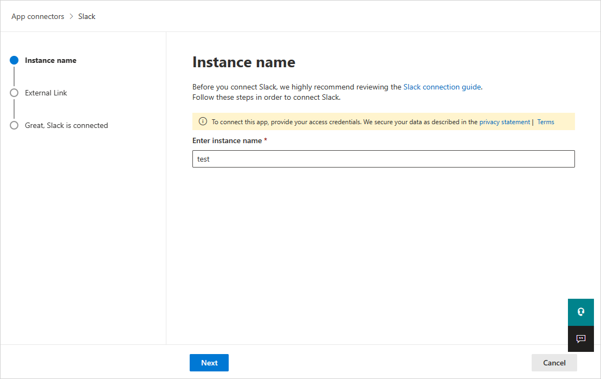

# Connect Slack to Microsoft Defender for Cloud Apps

<!--migrated, remove-->
[!INCLUDE [Banner for top of topics](includes/banner.md)]

This article provides instructions for connecting Microsoft Defender for Cloud Apps to your existing Slack using the App Connector APIs. This connection gives you visibility into and control over your organization's Slack use.

## Prerequisites

* Your Slack tenant must meet the following requirements:
  * Your Slack tenant must have an **Enterprise** license. Defender for Cloud Apps doesn't support non-enterprise licenses.
  * Your Slack tenant should have **Discovery API** enabled. To enable **Discovery API** for your Slack tenant, contact Slack support.

* The org Owner needs to be logged into their Slack organization within their browser before installing the connector.

## How to connect Slack to Defender for Cloud Apps

1. In the Microsoft 365 Defender portal, select **Settings**. Then choose **Cloud Apps**. Under **Connected apps**, select **App Connectors**.

1. In the **App connectors** page, select **+Connect an app**, followed by **Slack**.

1. In the next window, give the connector a descriptive name, and select **Next**.

    

1. In the **External Link** page, select **Connect Slack**.

    

1. You'll be redirected to the Slack page. Make sure the org Owner is already logged into the Slack organization.

1. In the Slack Authorization page, make sure to choose the correct organization from the dropdown in the top-right corner.
1. In the Microsoft 365 Defender portal, select **Settings**. Then choose **Cloud Apps**. Under **Connected apps**, select **App Connectors**. Make sure the status of the connected App Connector is **Connected**.

    >[!NOTE]
    >
    > * The first connection can take up to 4 hours to get all users and their activities in the 7 days before the connection.
    > * After the connector's **Status** is marked as **Connected**, the connector is live and works.
    > * The received activities are from the Slack Audit Log API. You can find them in the [Slack documentation](https://api.slack.com/admins/audit-logs#audit_logs_actions).
    > * **Send Slack message** activity is an activity that can be received from [Conditional Access App Control](proxy-deployment-aad.md), and not from the Slack API connector.

## Next steps

> [!div class="nextstepaction"]
> [Control cloud apps with policies](control-cloud-apps-with-policies.md)

[!INCLUDE [Open support ticket](includes/support.md)]
