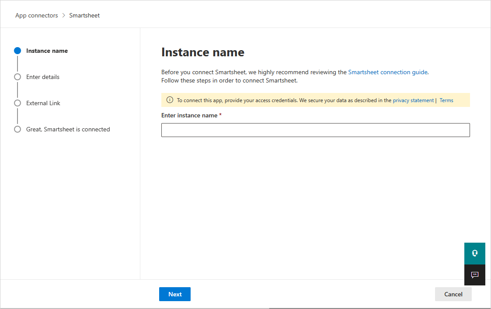

# Connect Smartsheet to Microsoft Defender for Cloud Apps

[!INCLUDE [Banner for top of topics](includes/banner.md)]

This article describes how to connect Microsoft Defender for Cloud Apps to your existing Smartsheet via the App Connector APIs. The resulting connection gives you visibility into and control over your organization's use of Smartsheet.

## Prerequisites

- The Smartsheet user used to log in to Smartsheet must be a System Admin.
- Event Reporting must be enabled by Smartsheet, either through standalone purchase or via an Enterprise plan with the Advance Platinum package.

## How to connect Smartsheet to Defender for Cloud Apps

### Configure Smartsheet

>[!NOTE]
>The Smartsheet license must be an Enterprise plan with the Platinum package.
>
>Smartsheet accounts hosted in the EU region (the .eu domain suffix) aren't currently supported.

1. Register to add Developer Tools to your existing Smartsheet account:
    1. Go to the [Developer Sandbox Account Registration](https://developers.smartsheet.com/register/) page.

    1. Enter your Smartsheet email address in the text box:

        

    1. An activation mail will appear in your mailbox. Activate Developer Tools by using the activation mail.

    1. In Smartsheet, select **Create Developer Profile**. Enter your name and email address. Select **Save** and then **Close**:

       

2. In Smartsheet, select **Developer Tools**:

   

3. In the **Developer Tools** dialog, select **Create New App**:

   

4. In the **Create New App** dialog, provide the following values:
    - **App name**: For example, **Microsoft Defender for Cloud Apps**.
    - **App description**: For example, **Microsoft Defender for Cloud Apps connects to Smartsheet via its API and detects threats within users' activity.**
    - **App URL**: `https://portal.cloudappsecurity.com`
    - **App contact/support**: `https://learn.microsoft.com/cloud-app-security/support-and-ts`
    - **App redirect URL**: `https://portal.cloudappsecurity.com/api/oauth/saga`

      > [!NOTE]
      >
      > - For US Government GCC customers, enter the following value: `https://portal.cloudappsecuritygov.com/api/oauth/saga`
      > - For US Government GCC High customers, enter the following value: `https://portal.cloudappsecurity.us/api/oauth/saga`

    - **Publish App?**: Select.
    - **Logo**: Leave blank.

      

5. Select **Save**. Copy the **App client id** and the **App secret** that are generated. You'll need them in the following steps.

### Configure Defender for Cloud Apps

>[!NOTE]
>The Smartsheet user configuring the integration must always remain a Smartsheet admin, even after the connector is installed.

1. In the [Defender for Cloud Apps portal](https://portal.cloudappsecurity.com/), select **Investigate** and then **Connected apps**.

2. On the **App connectors** tab, select the plus sign, and then select **Smartsheet**.

3. In the window that appears, give the connector a descriptive name, and then select **Connect Smartsheet**:

    

4. On the next screen, enter these values:

    - **Client ID**: The app client ID that you saved earlier.
    - **Client Secret**: The app secret that you saved earlier.

5. Select **Connect in Smartsheet**.
6. Make sure the connection succeeded by selecting **Test now**. The test might take a few minutes. After you see a success notice, select **Close**.
7. The first connection can take up to four hours to get all users and their activities in the seven days before the connection.
8. After the connector's **Status** is marked as **Connected**, the connector is live and works.

## Limitations

- Log in and log out activities aren't supported by Smartsheet.
- Smartsheet activities don't contain IP addresses.
- System activities are shown with the Smartsheet account name.

## Rate limits

The default rate limit is 300 requests per minute. For more information, see the [Smartsheet documentation](https://smartsheet.redoc.ly/#section/Work-at-Scale/Rate-Limiting).

## Next steps

> [!div class="nextstepaction"]
> [Control cloud apps by using policies](control-cloud-apps-with-policies.md)

[!INCLUDE [Open support ticket](includes/support.md)]
