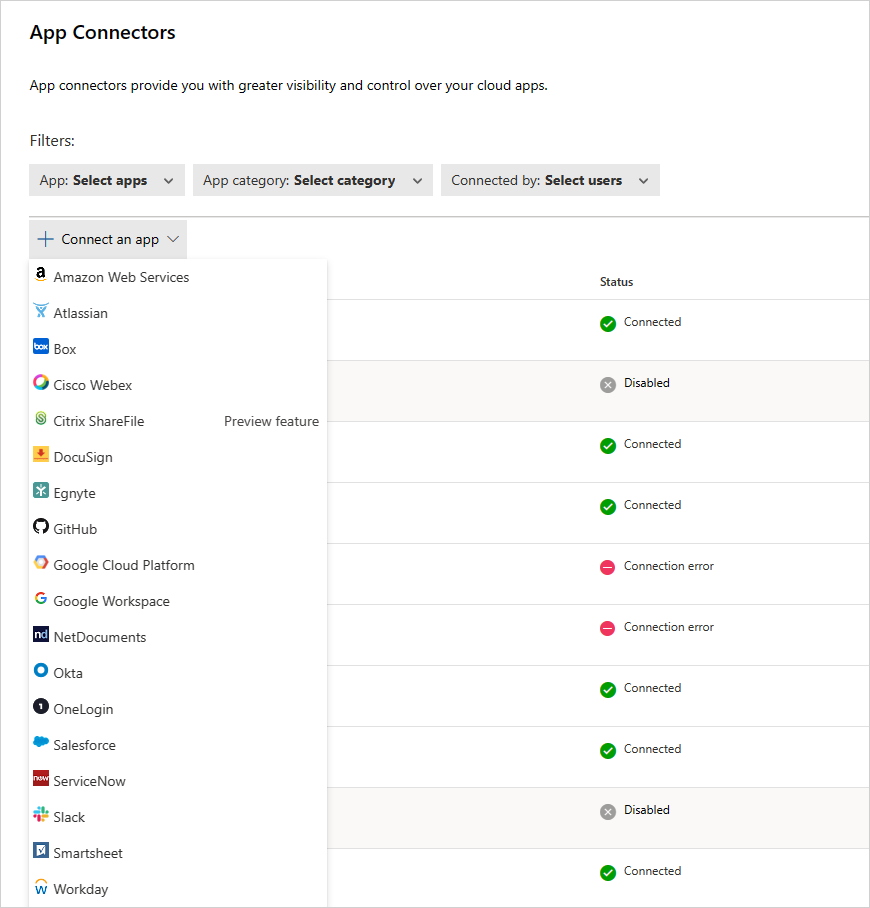
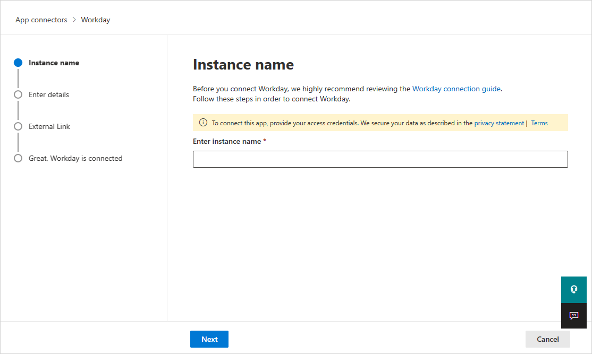
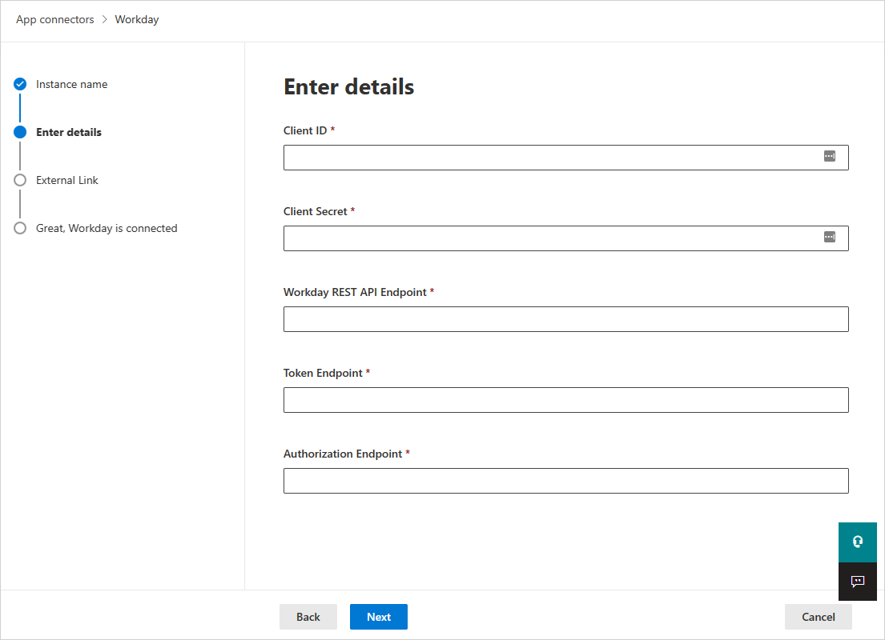

# Connect Workday to Microsoft Defender for Cloud Apps

[!INCLUDE [Banner for top of topics](includes/banner.md)]

This article provides instructions for connecting Microsoft Defender for Cloud Apps to your existing Workday account using the app connector API. This connection gives you visibility into and control over Workday use. For information about how Defender for Cloud Apps protects Workday, see [Protect Workday](protect-workday.md).

## Quick start

Watch our quick start video showing how to configure the prerequisites and perform the steps in Workday. Once you've completed the steps in the video, you can proceed to [add the Workday connector](#add-connector).

> [!NOTE]
> The video does not show the prerequisite step for configuring the security group **Set Up: Tenant Setup –  System** permission. Make sure you configure it as well.

 

> [!VIDEO https://www.microsoft.com/videoplayer/embed/RE4n1ZO]

## Prerequisites

The Workday account used for connecting to Defender for Cloud Apps must be a member of a security group (new or existing). We recommended using a Workday Integration System User. The security group must have the following permissions selected for the following domain security policies:

| Functional area | Domain Security policy | Subdomain Security policy | Report/Task Permissions | Integration Permissions |
| --- | --- | --- | --- | --- |
| System | Set Up: Tenant Setup – General | Set Up: Tenant Setup –  Security | View, Modify | Get, Put |
| System | Set Up: Tenant Setup – General | Set Up: Tenant Setup –  System | Modify | None |
| System | Security Administration | | View, Modify | Get, Put |
| System | System auditing | | View | Get |
| Staffing | Worker Data: Staffing | Worker Data: Public Worker Reports | View | Get |

> [!NOTE]
>
> * The account that is used to set up permissions for the security group must be a Workday Administrator.
> * To set permissions, search for "Domain Security Policies for Functional Area", then search for each functional area ("System"/"Staffing") and grant the permissions listed in the table.
> * Once all permissions have been set, search for "Activate Pending Security Policy Changes" and approve the changes.

For more information about setting up Workday integration users, security groups, and permissions, see steps 1 to 4 of the [Grant Integration or External Endpoint Access to Workday](https://go.microsoft.com/fwlink/?linkid=2103212) guide (accessible with Workday documentation/community credentials).

## How to connect Workday to Defender for Cloud Apps using OAuth

1. Sign in to Workday with an account that is a member of the security group mentioned in the prerequisites.

1. Search for "Edit tenant setup – system", and under **User Activity Logging**, select **Enable User Activity Logging**.

    

1. Search for "Edit tenant setup – security", and under **OAuth 2.0 Settings**, select **OAuth 2.0 Clients Enabled**.

1. Search for "Register API Client" and select **Register API Client – Task**.

1. On the **Register API Client** page, fill out the following information, and then click **OK**.

    | Field name | Value |
    | ---- | ---- |
    | Client Name | Microsoft Defender for Cloud Apps |
    | Client Grant Type | Authorization Code Grant |
    | Access Token Type | Bearer |
    | Redirection URI | `https://portal.cloudappsecurity.com/api/oauth/connect`  **Note**: For US Government GCC High customers, enter the following value: `https://portal.cloudappsecurity.us/api/oauth/connect` |
    | Non-Expiring Refresh Tokens | Yes |
    | Scope (Functional Areas) | **Staffing** and **System** |

    

1. Once registered, make a note for the following parameters, and then click **Done**.

    * Client ID
    * Client Secret
    * Workday REST API Endpoint
    * Token Endpoint
    * Authorization Endpoint

    
    
>[!NOTE]
>If the Workday account is enabled with SAML SSO, then append the query string parameter `'redirect=n'` to the authorization endpoint. 
>
>If the authorization endpoint already has other query string parameters, then append `'&redirect=n'` to the end of authorization endpoint. If the authorization endpoint doesn't have any query string parameters, then append `'?redirect=n'` to the end of authorization endpoint.

1. In the Defender for Cloud Apps portal, click **Investigate** and then click **Connected Apps**.

1. In the **App connectors** page, click the plus button and then **Workday**.

    

1. In the pop-up, add your instance name and then click **Connect Workday**.

    

1. On the next page, fill out the details with the information you noted earlier, and then click **Connect in Workday**.

    

1. In Workday, a pop-up appears asking you if you want to allow Defender for Cloud Apps access to your Workday account. To proceed, click **Allow**.

    

1. Back in the Defender for Cloud Apps portal, you should see a message that Workday was successfully connected. Make sure the connection succeeded by clicking **Test API**.

    Testing may take a couple of minutes. After receiving a success notice, click **Close**.

> [!NOTE]
> After connecting Workday, you'll receive events for seven days prior to connection.

> [!NOTE]
> If you are connecting Defender for Cloud Apps to a Workday sandbox account for testing, note that Workday refreshes their sandbox account every week, causing the Defender for Cloud Apps connection to fail. You should reconnect the sandbox environment every week with Defender for Cloud Apps to continue testing.

If you have any problems connecting the app, see [Troubleshooting App Connectors](troubleshooting-api-connectors-using-error-messages.md).

## Next steps

> [!div class="nextstepaction"]
> [Control cloud apps with policies](control-cloud-apps-with-policies.md)

[!INCLUDE [Open support ticket](includes/support.md)]
