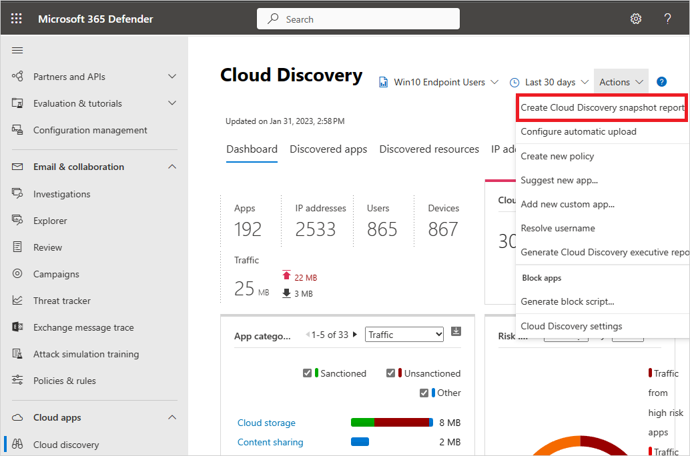

# Use a custom log parser

[!INCLUDE [Banner for top of topics](includes/banner.md)]

Defender for Cloud Apps enables you to configure a custom parser to match and process the format of your logs so that they can be used for Cloud Discovery. Typically you would use a custom parser if the firewall or device is not explicitly supported by Defender for Cloud Apps. This can be a CSV parser or a custom key value parser.

The custom parser enables you to use logs from unsupported firewalls by following this process.

To configure a custom parser:

1. In the [Defender for Cloud Apps portal](https://portal.cloudappsecurity.com/), select **Discover** and then **Create snapshot report**.

    

2. Enter a **Report name** and a **Description**

3. Under **Source**, select **Custom log format...**.

    

4. Collect logs from your firewall and proxy, through which users in your organization access the Internet. Make sure to gather logs during times of peak traffic that are representative of all user activity in your organization.

5. Open the logs you want to process in a text editor. Review their format, making sure that the column names in the log correspond to the fields in the **Custom log format** screen.

    

6. Then, fill in the fields based on your data to delineate which columns in the data correlate to specific fields in Defender for Cloud Apps. You may have to modify column names in your log file to correlate properly.

    > [!NOTE]
    > The fields are case-sensitive. Make sure you spell and type the names of the columns identically in Defender for Cloud Apps and in the log file. Also, make sure that the date format you choose is identical.

    

7. Select **Save**. The custom log format your configured will be saved as the default custom parser. You can edit it at any time by clicking on **Edit**.

8. Under **Upload traffic logs**, select the log file you modified and upload it. You can upload up to 20 files at once. Compressed and zipped files are also supported.

9. Select **Upload logs**.

10. After upload completes, the status message will appear at the top-right corner of your screen letting you know that your log was successfully uploaded.

11. After you upload your log files, it will take some time for them to be parsed and analyzed.
    After processing of your log files completes, you'll receive an email to notify you that it's done.

12. A notification banner will appear in the status bar at the top of the **Cloud Discovery dashboard**. The banner updates you with the processing status of your log files.
    

13. After the logs are uploaded successfully, you should see a notification letting you know that the log file processing completed successfully. At this point, you can view the report either by clicking the link in the status bar, or by going to the Settings cog and selecting **Cloud Discovery settings**.

    
14. Then selecting **Manage snapshot reports** and select your snapshot report.

    

## Next steps

> [!div class="nextstepaction"]
> [Create snapshot Cloud Discovery reports](create-snapshot-cloud-discovery-reports.md)

> [!div class="nextstepaction"]
> [Configure automatic log upload for continuous reports](discovery-docker.md)

> [!div class="nextstepaction"]
> [Working with Cloud Discovery data](working-with-cloud-discovery-data.md)

[!INCLUDE [Open support ticket](includes/support.md)]
