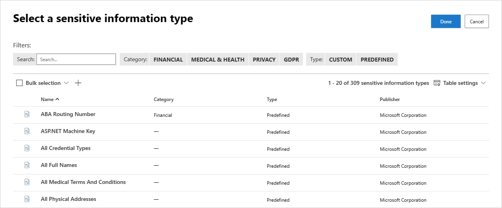

# Microsoft Data Classification Services integration

[!INCLUDE [Banner for top of topics](includes/banner.md)]

Microsoft Defender for Cloud Apps enables you to natively use the Microsoft Data Classification Service to classify the files in your cloud apps. Microsoft Data Classification Service provides a unified information protection experience across Office 365, Microsoft Information Protection, and Microsoft Defender for Cloud Apps. The classification service allows you to extend your data classification efforts to the third-party cloud apps protected by Microsoft Defender for Cloud Apps, using the decisions you already made across an even greater number of apps.

>[!NOTE]
> This feature is currently available in the US, Europe, Australia, India, Canada, Japan, and APAC.

## Enable content inspection with Data Classification Services

You can set the **Inspection method** to use the **Microsoft Data Classification Service** with no additional configuration required. This option is useful when creating a data leak prevention policy for your files in Microsoft Defender for Cloud Apps.

1. In the [file policy](data-protection-policies.md) page, under **Inspection method**, select **Data Classification Service**. You can also set the **Inspection method** in the [session policy](session-policy-aad.md) page with **Control file download (with inspection)** selected.

    
2. Select whether the policy should apply when **any** or **all** of the criteria are met.
3. **Choose inspection type** by selecting the **Sensitive information types**.

    

4. You can use the [default sensitive information types](https://support.office.com/article/what-the-sensitive-information-types-look-for-fd505979-76be-4d9f-b459-abef3fc9e86b) to define what happens to files protected by Microsoft Defender for Cloud Apps. You can also reuse any of your [Office 365 custom sensitive information types](https://support.office.com/article/create-a-custom-sensitive-information-type-82c382a5-b6db-44fd-995d-b333b3c7fc30).
    > [!NOTE]
    > You can configure your policy to use advanced classification types such as [Fingerprints](/microsoft-365/compliance/document-fingerprinting?view=o365-worldwide&preserve-view=true), [Exact Data Match](/microsoft-365/compliance/sit-learn-about-exact-data-match-based-sits), and [trainable classifiers](/microsoft-365/compliance/classifier-get-started-with).

5. Optionally, you can unmask the last four characters of a match. By default, matches are masked and shown in their context, and include the 40 characters before and after the match. If you select this checkbox, it will unmask the last four characters of the match itself.

6. Leveraging file policies, you can also set alerts and governance actions for the policy. For more information, see [file policies](data-protection-policies.md) and [governance actions](governance-actions.md). Leveraging session policies, you can also monitor and control actions in real-time when a file matches a DCS type. For more information, see [session policy](session-policy-aad.md).

Setting these policies enables you to easily extend the strength of the Office 365 DLP capabilities to all your other sanctioned cloud apps and protect the data stored in them with the full toolset provided to you by Microsoft Defender for Cloud Apps – such as the ability to [automatically apply Microsoft Information Protection sensitivity labels](azip-integration.md) and the ability to control sharing permissions.

## Examine evidence (preview)

Defender for Cloud Apps already includes the ability to explore policy file matches that contain sensitive information types (SITs). Now Defender for Cloud Apps also allows you to differentiate between multiple SITs in the same file match. This feature, known as short evidence, lets Defender for Cloud Apps better manage and protect your organization's sensitive data.

The short evidence feature is relevant for file policies that contain content inspection using the DCS engine.

1. Configure a file policy and choose the relevant DCS classifiers. If you already use a file policy with DCS, this feature will work for all the feature's files.

1. On the **Policies** page, enter the relevant file policy and select the policy matches.

1. You can then analyze the different SITs with a clickable, color-coding distinguisher.

:::image type="content" source="media/short-evidence.png" alt-text="Configure short evidence." lightbox="media/short-evidence.png":::

## Next steps

> [!div class="nextstepaction"]
> [Control cloud apps with policies](control-cloud-apps-with-policies.md)

[!INCLUDE [Open support ticket](includes/support.md)]
