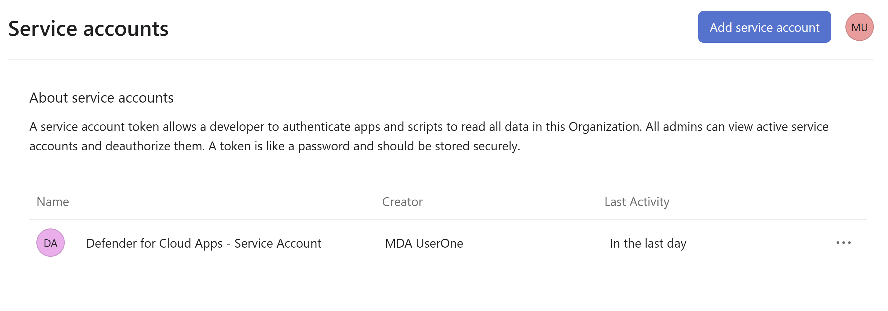
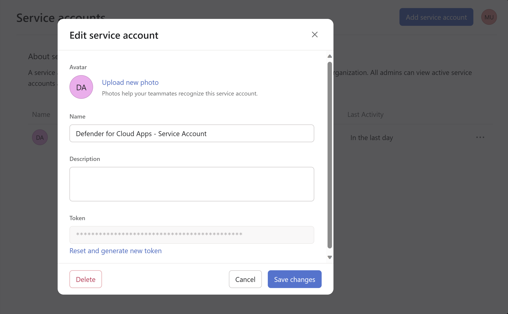

# How Defender for Cloud Apps helps protect your Asana environment

[!INCLUDE [Banner for top of topics](includes/banner.md)]

Asana is a cloud-based project management tool that enables your users to collaborate on projects and tasks across your organization and partners in a streamlined and efficient way. Asana holds critical data of your organization, and this makes it a target for malicious actors. 

Connecting Asana to Defender for Cloud Apps gives you improved insights into your users' activities and provides threat detection using machine learning based anomaly detections.

Main threats include:

- Compromised accounts and insider threats
- Data leakage
- Insufficient security awareness
- Unmanaged bring your own device (BYOD)

## Control Asana with policies

| **Type**                           | **Name**                                                     |
| ---------------------------------- | ------------------------------------------------------------ |
| **Built-in  anomaly detection policy** | [Activity from   anonymous IP addresses](anomaly-detection-policy.md#activity-from-anonymous-ip-addresses)    [Activity from   infrequent country](anomaly-detection-policy.md#activity-from-infrequent-country)   [Activity from   suspicious IP addresses](anomaly-detection-policy.md#activity-from-suspicious-ip-addresses)    [Impossible travel](anomaly-detection-policy.md#impossible-travel)    [Activity   performed by terminated user](anomaly-detection-policy.md#activity-performed-by-terminated-user) (requires Microsoft Entra ID as IdP)    [Multiple failed   login attempts](anomaly-detection-policy.md#multiple-failed-login-attempts)    [Unusual   administrative activities](anomaly-detection-policy.md#unusual-activities-by-user)    [Unusual impersonated activities](anomaly-detection-policy.md#unusual-activities-by-user) |
| **Activity  policy**                   | Built a customized policy by using the [Asana Audit Log](https://developers.asana.com/docs/audit-log-events) activities |

For more information about creating policies, see [Create a policy](control-cloud-apps-with-policies.md#create-a-policy).

## Automate governance controls

In addition to monitoring for potential threats, you can apply and automate the following Asana governance actions to remediate detected threats:

| **Type**        | **Action**                                                   |
| --------------- | ------------------------------------------------------------ |
| **User governance** | Notify user on  alert (via Microsoft Entra ID)   Require user to sign in again (via Microsoft Entra ID)     Suspend user (via Microsoft Entra ID) |

For more information about remediating threats from apps, see [Governing connected apps](governance-actions.md).

## Connect Asana to Defender for Cloud Apps

This sections describes how to connect Microsoft Defender for Cloud Apps to your existing Asana account using the App Connector APIs. This connection gives you visibility into and control over your organization's Asana use.

**Prerequisites:**

- An Asana enterprise account is a pre-requisite for this connection. You must be signed-in as an admin to Asana. 

**To connect Asana**:

1. Sign into [Asana](https://app.asana.com/) portal with an admin account.

2. Navigate to **Admin Console>Apps>Service accounts** and click on your service account. If you don’t have a Service account, create one using the guidance provided [here](https://asana.com/guide/help/premium/service-accounts).

3. Copy the service account Token. You may have to **Reset and generate new token** to copy the token if you have an existing service account. 

4. Copy the workspace ID from the URL and save it for future reference.

5. In the [Microsoft Defender portal](https://security.microsoft.com), navigate to **Settings>Cloud Apps>Connected apps>App Connectors**.

6. Click on **Connect an app** and select **Asana.**

7. Provide an Instance name in the connection wizard and click on **Next.**
8. Enter the copied access token and workspace ID in API Key and workspace ID fields respectively. Once entered click on **Submit**.

9. Defender for Cloud Apps will start fetch Asana audit logs once connection is successfully established.

If you have any problems connecting the app, see [Troubleshooting App Connectors](/defender-cloud-apps/troubleshooting-api-connectors-using-error-messages).

## Related content

<!--moved this from "how mda ..."-->
- [Detect cloud threats, compromised accounts, and malicious insiders](best-practices.md#detect-cloud-threats-compromised-accounts-malicious-insiders-and-ransomware)
- [Use the audit trail of activities for forensic investigations](best-practices.md#use-the-audit-trail-of-activities-for-forensic-investigations)