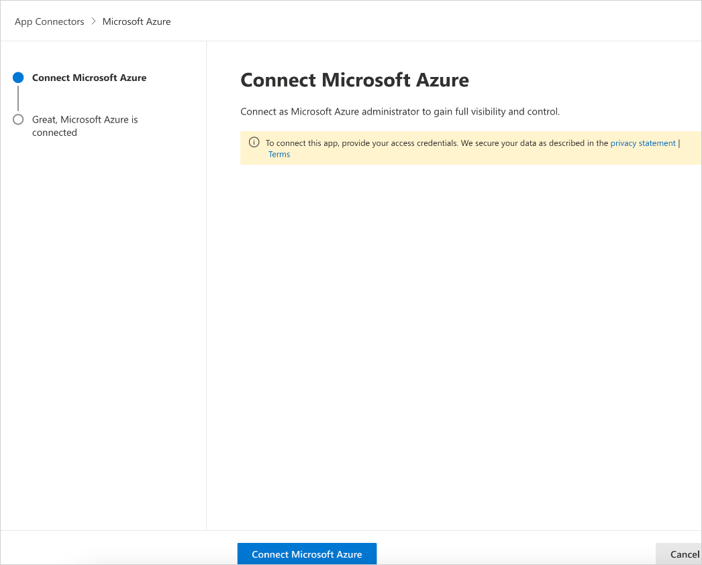

# How Defender for Cloud Apps helps protect your Azure environment

[!INCLUDE [Banner for top of topics](includes/banner.md)]

Azure is an IaaS provider that enables your organization to host and manage their entire workloads in the cloud. Along with the benefits of leveraging infrastructure in the cloud, your organization's most critical assets may be exposed to threats. Exposed assets include storage instances with potentially sensitive information, compute resources that operate some of your most critical applications, ports, and virtual private networks that enable access to your organization.

Connecting Azure to Defender for Cloud Apps helps you secure your assets and detect potential threats by monitoring administrative and sign-in activities, notifying on possible brute force attacks, malicious use of a privileged user account, and unusual deletions of VMs.

## Main threats

- Abuse of cloud resources
- Compromised accounts and insider threats
- Data leakage
- Resource misconfiguration and insufficient access control

## How Defender for Cloud Apps helps to protect your environment

- [Detect cloud threats, compromised accounts, and malicious insiders](best-practices.md#detect-cloud-threats-compromised-accounts-malicious-insiders-and-ransomware)
- [Limit exposure of shared data and enforce collaboration policies](best-practices.md#limit-exposure-of-shared-data-and-enforce-collaboration-policies)
- [Use the audit trail of activities for forensic investigations](best-practices.md#use-the-audit-trail-of-activities-for-forensic-investigations)

## Control Azure with built-in policies and policy templates

You can use the following built-in policy templates to detect and notify you about potential threats:

| Type | Name |
| ---- | ---- |
| Built-in anomaly detection policy | [Activity from anonymous IP addresses](anomaly-detection-policy.md#activity-from-anonymous-ip-addresses) [Activity from infrequent country](anomaly-detection-policy.md#activity-from-infrequent-country) [Activity from suspicious IP addresses](anomaly-detection-policy.md#activity-from-suspicious-ip-addresses) [Activity performed by terminated user](anomaly-detection-policy.md#activity-performed-by-terminated-user) (requires Azure Active Directory as IdP) [Multiple failed login attempts](anomaly-detection-policy.md#multiple-failed-login-attempts) [Unusual administrative activities](anomaly-detection-policy.md#unusual-activities-by-user) [Unusual multiple storage deletion activities](anomaly-detection-policy.md#unusual-activities-by-user) (preview) [Multiple delete VM activities](anomaly-detection-policy.md#multiple-delete-vm-activities) [Unusual multiple VM creation activities](anomaly-detection-policy.md#unusual-activities-by-user) (preview) |

For more information about creating policies, see [Create a policy](control-cloud-apps-with-policies.md#create-a-policy).

## Automate governance controls

In addition to monitoring for potential threats, you can apply and automate the following Azure governance actions to remediate detected threats:

| Type | Action |
| ---- | ---- |
| User governance | - Notify user on alert (via Azure AD) - Require user to sign in again (via Azure AD) - Suspend user (via Azure AD) |

For more information about remediating threats from apps, see [Governing connected apps](governance-actions.md).

## Protect Azure in real time

Review our best practices for [securing and collaborating with external users](best-practices.md#secure-collaboration-with-external-users-by-enforcing-real-time-session-controls) and [blocking and protecting the download of sensitive data to unmanaged or risky devices](best-practices.md#block-and-protect-download-of-sensitive-data-to-unmanaged-or-risky-devices).

## Connect Azure to Microsoft Defender for Cloud Apps

This section provides instructions for connecting Microsoft Defender for Cloud Apps to your existing Azure account using the app connector API. This connection gives you visibility into and control over Azure use. For information about how Defender for Cloud Apps protects Azure, see [Protect Azure](protect-azure.md).

> [!NOTE]
>
> - User must be a Global or Security administrator in Azure AD to connect Azure to Microsoft Defender for Cloud Apps.
> - Defender for Cloud Apps displays activities from **all** subscriptions.
> - User account information is populated in Defender for Cloud Apps as users perform activities in Azure.
> - Currently, Defender for Cloud Apps monitors only ARM activities.

**To connect Azure to Defender for Cloud Apps**: 

1. In the Microsoft Defender Portal, select **Settings**. Then choose **Cloud Apps**. Under **Connected apps**, select **App Connectors**.

1. In the **App connectors** page, select **+Connect an app**, followed by **Microsoft Azure**.

    

1. In the **Connect Microsoft Azure** page, select **Connect Microsoft Azure**.

    
1. In the Microsoft Defender Portal, select **Settings**. Then choose **Cloud Apps**. Under **Connected apps**, select **App Connectors**. Make sure the status of the connected App Connector is **Connected**.

> [!NOTE]
> After connecting Azure, data will be pulled. You will see data from then onwards.

If you have any problems connecting the app, see [Troubleshooting App Connectors](troubleshooting-api-connectors-using-error-messages.md).

## Next steps

> [!div class="nextstepaction"]
> [Control cloud apps with policies](control-cloud-apps-with-policies.md)

[!INCLUDE [Open support ticket](includes/support.md)]

