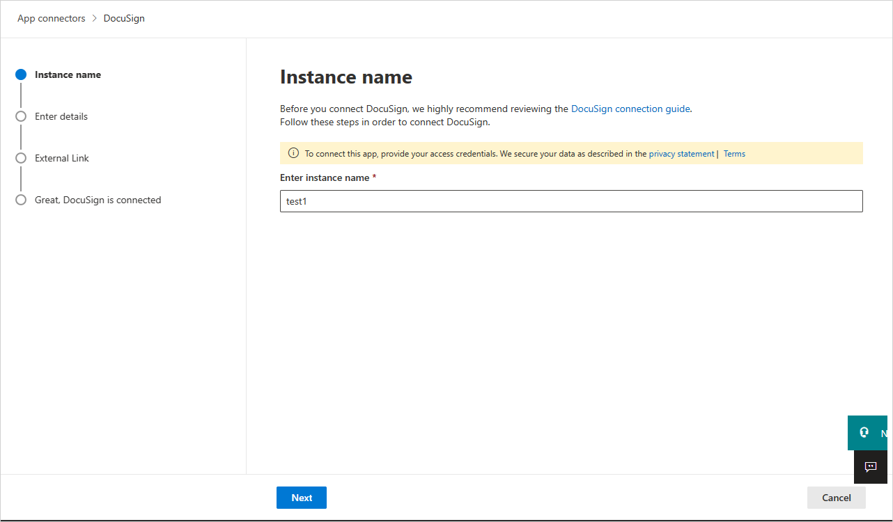
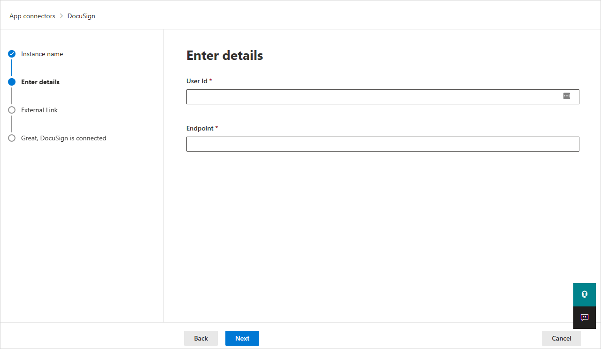

# How Defender for Cloud Apps helps protect your DocuSign environment

[!INCLUDE [Banner for top of topics](includes/banner.md)]

DocuSign helps organizations manage electronic agreements, and so your DocuSign environment holds sensitive information for your organization. Any abuse of DocuSign by a malicious actor or any human error may expose your most critical assets to potential attacks.

Connecting your DocuSign environment to Defender for Cloud Apps gives you improved insights into your DocuSign admin activities and managed users sign-ins, and provides threat detection for anomalous behavior.

[!INCLUDE [security-posture-management-connector](includes/security-posture-management-connector.md)]

## Main threats

- Compromised accounts and insider threats
- Data leakage
- Insufficient security awareness
- Unmanaged bring your own device (BYOD)

## How Defender for Cloud Apps helps to protect your environment

- [Detect cloud threats, compromised accounts, and malicious insiders](best-practices.md#detect-cloud-threats-compromised-accounts-malicious-insiders-and-ransomware)

- [Use the audit trail of activities for forensic investigations](best-practices.md#use-the-audit-trail-of-activities-for-forensic-investigations)

## SaaS security posture management

To see security posture recommendations for DocuSign in Microsoft Secure Score, create an API connector via the **Connectors** tab. If a connector already exists and you don't see GitHub recommendations yet, refresh the connection by disconnecting the API connector, and then reconnecting it.

In Secure Score, select **Recommended actions** and filter by **Product** = **DocuSign**. DocuSign supports security recommendations for session timeout and password requirements.

For more information, see:

- [Connect DocuSign to Microsoft Defender for Cloud Apps](#connect-docusign-to-microsoft-defender-for-cloud-apps)
- [Security posture management for SaaS apps](security-saas.md)
- [Microsoft Secure Score](/microsoft-365/security/defender/microsoft-secure-score)

## Control DocuSign with policies

| **Type**                           | **Name**                                                     |
| ---------------------------------- | ------------------------------------------------------------ |
| Built-in  anomaly detection policy | [Activity from anonymous IP addresses](anomaly-detection-policy.md#activity-from-anonymous-ip-addresses)   [Activity from infrequent countries/regions](anomaly-detection-policy.md#activity-from-infrequent-country)   [Activity from suspicious IP addresses](anomaly-detection-policy.md#activity-from-suspicious-ip-addresses)   [Impossible travel](anomaly-detection-policy.md#impossible-travel)   [Activity performed by terminated user](anomaly-detection-policy.md#activity-performed-by-terminated-user) (requires Microsoft Entra ID as IdP)   [Multiple failed login attempts](anomaly-detection-policy.md#multiple-failed-login-attempts)  |

| Activity  policy                   | Build a customized policy by the DocuSign audit log           |

For more information about creating policies, see [Create a policy](control-cloud-apps-with-policies.md#create-a-policy).

## Automate governance controls

In addition to monitoring for potential threats, you can apply and automate the following DocuSign governance actions to remediate detected threats:

| **Type**        | **Action**                                                   |
| --------------- | ------------------------------------------------------------ |
| User governance | Notify user on  alert (via Microsoft Entra ID)   Require user to sign in again (via Microsoft Entra ID)     Suspend user (via Microsoft Entra ID) |

For more information about remediating threats from apps, see [Governing connected apps](governance-actions.md).

## Protect DocuSign in real time

Review our best practices for [securing and collaborating with external users](best-practices.md#secure-collaboration-with-external-users-by-enforcing-real-time-session-controls) and [blocking and protecting the download of sensitive data to unmanaged or risky devices](best-practices.md#block-and-protect-download-of-sensitive-data-to-unmanaged-or-risky-devices).

## Connect DocuSign to Microsoft Defender for Cloud Apps

This section provides instructions for connecting Microsoft Defender for Cloud Apps to your existing DocuSign environment using the App Connector APIs. This connection gives you visibility into and control over your organization’s DocuSign use.

[!INCLUDE [security-posture-management-connector](includes/security-posture-management-connector.md)]

### Prerequisites

- **DocuSign Enterprise Pro account plan with Monitor API enabled.**
  - For more information about DocuSign Monitor API, see [How to get monitoring data | DocuSign](https://developers.docusign.com/docs/monitor-api/how-to/get-monitoring-data/) and [Enable DocuSign Monitor for your organization | DocuSign](https://developers.docusign.com/docs/monitor-api/how-to/enable-monitor/).

- **DNS domains used in your organization should be claimed and validated in your DocuSign organization.** For more information on claiming and validating domains, see [Domains | DocuSign](https://support.docusign.com/en/guides/org-admin-guide-claim-domain/)

- **The DocuSign user used for logging into DocuSign must be mapped to the user role 'Docusign Administrator' and must be an organization admin of one organization only.** For more information, see the prerequisite role in [How to get monitoring data | DocuSign](https://developers.docusign.com/docs/monitor-api/how-to/get-monitoring-data/) and [Organization Administrators - DocuSign Admin for Organization Management | DocuSign Support Center](https://support.docusign.com/en/guides/org-admin-guide-org-admins).
- Due to DocuSign’s API limitation, in order to have SaaS Security Posture management (SSPM) support there's a need to reconnect it with additional permissions: **account_read account_write** and **user_read organization_read**.

- **The DocuSign account must be mapped to an organization**. For more information, see:

  - Create new organization: [Organizations - DocuSign Admin for Organization Management | DocuSign Support Center](https://support.docusign.com/en/guides/org-admin-guide-create-org)

  - Link account to an existing organization: [Managing Accounts - DocuSign Admin for Organization Management | DocuSign Support Center](https://support.docusign.com/en/guides/org-admin-guide-accounts)

  - DocuSign Organization Admin guide: [DocuSign Admin for Organization Management (PDF) | DocuSign Support Center](https://support.docusign.com/guides/org-admin-guide).

### Configure DocuSign

1. Sign into a DocuSign account that is mapped to your organization (you should be an account Admin for that account).  

1. Go to **Settings** and then **Apps and keys**.

1. Copy the User ID and Account Base URI. You'll need them later.

    

### Configure Defender for Cloud Apps

1. In the Microsoft Defender Portal, select **Settings**. Then choose **Cloud Apps**. Under **Connected apps**, select **App Connectors**.

1. In the **App connectors** page, select **+Connect an app**, and then select **DocuSign**.

1. In the window that appears, give the connector a descriptive name, and then select **Next**.

    

1. In the next screen, enter the following:

    - User ID: the User ID that you copied earlier.
    - Endpoint: the Account Base URI you copied earlier.

    

1. Select **Next**.
1. In the next screen, select **Connect DocuSign**.

1. In the Microsoft Defender Portal, select **Settings**. Then choose **Cloud Apps**. Under **Connected apps**, select **App Connectors**. Make sure the status of the connected App Connector is **Connected**.

> [!NOTE]
> SaaS Security Posture Management (SSPM) data will be shown in the Microsoft Defender Portal on the **Secure Score** page. For more information, see [Security posture management for SaaS apps](/defender-cloud-apps/security-saas).

## Limitations

- Only active DocuSign users will be shown in Defender for Cloud Apps.
   - If a user isn't active in all of the DocuSign accounts mapped to the connected DocuSign organization, the user will be shown as deleted in Defender for Cloud Apps.
- For SaaS Security Posture Management (SSPM) support, the provided credentials must have these permissions - **account_read account_write** and **user_read organization_read**.
- Defender for Cloud Apps won't show whether a user is an administrator or not.
- The DocuSign activities that will be shown in Defender for Cloud Apps are the activities at the account level (of every account that is mapped to the connected DocuSign organization) and at the organization level.

## Next steps

> [!div class="nextstepaction"]
> [Control cloud apps by using policies](control-cloud-apps-with-policies.md)

[!INCLUDE [Open support ticket](includes/support.md)]