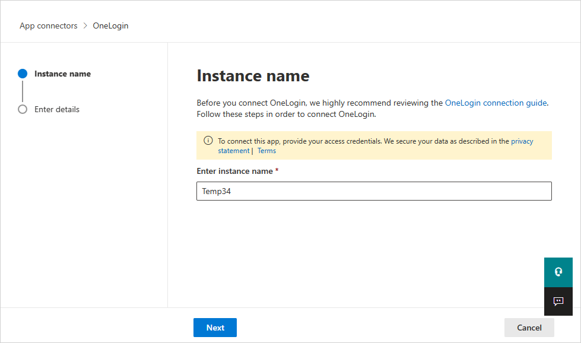

# How Defender for Cloud Apps helps protect your OneLogin

[!INCLUDE [Banner for top of topics](includes/banner.md)]

As an identity and access management solution, OneLogin holds the keys to your organizations most business critical services. OneLogin manages the authentication and authorization processes for your users. Any abuse of OneLogin by a malicious actor or any human error may expose your most critical assets and services to potential attacks.

Connecting OneLogin to Defender for Cloud Apps gives you improved insights into your OneLogin admin activities and managed users sign-ins and provides threat detection for anomalous behavior.

## Main threats

- Compromised accounts and insider threats
- Data leakage
- Insufficient security awareness
- Unmanaged bring your own device (BYOD)

## How Defender for Cloud Apps helps to protect your environment

- [Detect cloud threats, compromised accounts, and malicious insiders](best-practices.md#detect-cloud-threats-compromised-accounts-malicious-insiders-and-ransomware)

- [Use the audit trail of activities for forensic investigations](best-practices.md#use-the-audit-trail-of-activities-for-forensic-investigations)

## Control OneLogin with policies

| **Type**                           | **Name**                                                     |
| ---------------------------------- | ------------------------------------------------------------ |
| Built-in  anomaly detection policy | [Activity from   anonymous IP addresses](anomaly-detection-policy.md#activity-from-anonymous-ip-addresses)    [Activity from   infrequent country](anomaly-detection-policy.md#activity-from-infrequent-country)   [Activity from   suspicious IP addresses](anomaly-detection-policy.md#activity-from-suspicious-ip-addresses)    [Impossible travel](anomaly-detection-policy.md#impossible-travel)    [Activity   performed by terminated user](anomaly-detection-policy.md#activity-performed-by-terminated-user) (requires Azure Active Directory as IdP)    [Multiple failed   login attempts](anomaly-detection-policy.md#multiple-failed-login-attempts)    [Unusual   administrative activities](anomaly-detection-policy.md#unusual-activities-by-user)    [Unusual impersonated activities](anomaly-detection-policy.md#unusual-activities-by-user) |
| Activity  policy                   | Built a customized policy by the  [OneLogin activities](https://developers.onelogin.com/api-docs/1/events/event-resource) |

For more information about creating policies, see [Create a policy](control-cloud-apps-with-policies.md#create-a-policy).

## Automate governance controls

In addition to monitoring for potential threats, you can apply and automate the following OneLogin governance actions to remediate detected threats:

| **Type**        | **Action**                                                   |
| --------------- | ------------------------------------------------------------ |
| User governance | Notify user on  alert (via Azure AD)   Require user to sign in again (via Azure AD)     Suspend user (via Azure AD) |

For more information about remediating threats from apps, see [Governing connected apps](governance-actions.md).

## Protect OneLogin in real time

Review our best practices for [securing and collaborating with external users](best-practices.md#secure-collaboration-with-external-users-by-enforcing-real-time-session-controls) and [blocking and protecting the download of sensitive data to unmanaged or risky devices](best-practices.md#block-and-protect-download-of-sensitive-data-to-unmanaged-or-risky-devices).

## Connect OneLogin to Microsoft Defender for Cloud Apps

This section provides instructions for connecting Microsoft Defender for Cloud Apps to your existing OneLogin app using the App Connector APIs. This connection gives you visibility into and control over your organization's OneLogin use.

### Prerequisites

- The OneLogin account used for logging into OneLogin must be a Super User. For more information about OneLogin administrative privileges, see [this article](https://onelogin.service-now.com/kb_view_customer.do?sysparm_article=KB0010391).

### Configure OneLogin

1. Go to the OneLogin admin portal. Select **API Credentials** in the **Developers** dropdown menu.

    

1. Select **New Credential**.
1. Name your new application as **Microsoft Defender for Cloud Apps**, choose **Read all** permissions, and select **Save**.

    

1. Copy the **Client ID** and the **Client Secret**. You'll need them in the following steps.

### Configure Defender for Cloud Apps

1. In the Microsoft 365 Defender portal, select **Settings**. Then choose **Cloud Apps**. Under **Connected apps**, select **App Connectors**.
1. In the **App connectors** page, select **+Connect an app**, followed by **OneLogin**.
1. In the next window, give the connector a descriptive name, and select **Next**.

    

1. In the **Enter details** window, enter the **Client ID** and the **Client Secret** that you copied and select **Submit**.
1. In the Microsoft 365 Defender portal, select **Settings**. Then choose **Cloud Apps**. Under **Connected apps**, select **App Connectors**. Make sure the status of the connected App Connector is **Connected**.
1. The first connection can take up to 4 hours to get all users and their activities after the connector was established.
1. After the connector's **Status** is marked as **Connected**, the connector is live and working.

## Next steps

> [!div class="nextstepaction"]
> [Control cloud apps with policies](control-cloud-apps-with-policies.md)

[!INCLUDE [Open support ticket](includes/support.md)]
