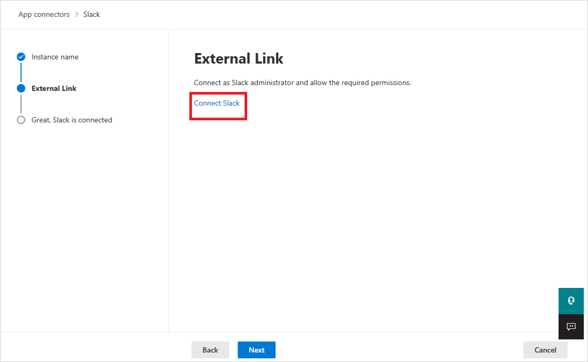

# How Defender for Cloud Apps helps protect your Slack Enterprise

[!INCLUDE [Banner for top of topics](includes/banner.md)]

Slack is a cloud service that helps organizations collaborate and communicate in one place. Along with the benefits of effective collaboration in the cloud, your organization's most critical assets may be exposed to threats. Exposed assets include messages, channels, and files with potentially sensitive information, collaboration, and partnership details, and more. Preventing exposure of this data requires continuous monitoring to prevent any malicious actors or security-unaware insiders from exfiltrating sensitive information.

Connecting Slack Enterprise to Defender for Cloud Apps gives you improved insights into your users' activities and provides threat detection for anomalous behavior.

## Main threats

- Compromised accounts and insider threats

- Data leakage

- Insufficient security awareness

- Unmanaged bring your own device (BYOD)

## How Defender for Cloud Apps helps to protect your environment

- [Detect cloud threats, compromised accounts, and malicious insiders](best-practices.md#detect-cloud-threats-compromised-accounts-malicious-insiders-and-ransomware)

- [Use the audit trail of activities for forensic investigations](best-practices.md#use-the-audit-trail-of-activities-for-forensic-investigations)

## Control Slack with policies

| **Type**                           | **Name**                                                     |
| ---------------------------------- | ------------------------------------------------------------ |
| Built-in  anomaly detection policy | [Activity from   anonymous IP addresses](anomaly-detection-policy.md#activity-from-anonymous-ip-addresses)    [Activity from   infrequent country](anomaly-detection-policy.md#activity-from-infrequent-country)   [Activity from   suspicious IP addresses](anomaly-detection-policy.md#activity-from-suspicious-ip-addresses)    [Impossible travel](anomaly-detection-policy.md#impossible-travel)    [Activity   performed by terminated user](anomaly-detection-policy.md#activity-performed-by-terminated-user) (requires Azure Active Directory as IdP)    [Multiple failed   login attempts](anomaly-detection-policy.md#multiple-failed-login-attempts)    [Unusual   administrative activities](anomaly-detection-policy.md#unusual-activities-by-user)    [Unusual impersonated activities](anomaly-detection-policy.md#unusual-activities-by-user) |
| Activity  policy                   | Built a customized policy by the  [Slack Audit Log](https://api.slack.com/admins/audit-logs#audit_logs_actions) activities |

For more information about creating policies, see [Create a policy](control-cloud-apps-with-policies.md#create-a-policy).

## Automate governance controls

In addition to monitoring for potential threats, you can apply and automate the following Slack governance actions to remediate detected threats:

| **Type**        | **Action**                                                   |
| --------------- | ------------------------------------------------------------ |
| User governance | Notify user on  alert (via Azure AD)   Require user to sign in again (via Azure AD)     Suspend user (via Azure AD) |

For more information about remediating threats from apps, see [Governing connected apps](governance-actions.md).

## Protect Slack in real time

Review our best practices for [securing and collaborating with external users](best-practices.md#secure-collaboration-with-external-users-by-enforcing-real-time-session-controls) and [blocking and protecting the download of sensitive data to unmanaged or risky devices](best-practices.md#block-and-protect-download-of-sensitive-data-to-unmanaged-or-risky-devices).

## Connect Slack to Microsoft Defender for Cloud Apps

This section provides instructions for connecting Microsoft Defender for Cloud Apps to your existing Slack using the App Connector APIs. This connection gives you visibility into and control over your organization's Slack use.

**Prerequisites**:

* Your Slack tenant must meet the following requirements:
  * Your Slack tenant must have an **Enterprise** license. Defender for Cloud Apps doesn't support non-enterprise licenses.
  * Your Slack tenant should have **Discovery API** enabled. To enable **Discovery API** for your Slack tenant, contact Slack support.

* The org Owner needs to be logged into their Slack organization within their browser before installing the connector.

**To connect Slack to Defender for Cloud Apps**:

1. In the Microsoft 365 Defender portal, select **Settings**. Then choose **Cloud Apps**. Under **Connected apps**, select **App Connectors**.

1. In the **App connectors** page, select **+Connect an app**, followed by **Slack**.

1. In the next window, give the connector a descriptive name, and select **Next**.

    

1. In the **External Link** page, select **Connect Slack**.

    

1. You'll be redirected to the Slack page. Make sure the org Owner is already logged into the Slack organization.

1. In the Slack Authorization page, make sure to choose the correct organization from the dropdown in the top-right corner.
1. In the Microsoft 365 Defender portal, select **Settings**. Then choose **Cloud Apps**. Under **Connected apps**, select **App Connectors**. Make sure the status of the connected App Connector is **Connected**.

    >[!NOTE]
    >
    > * The first connection can take up to 4 hours to get all users and their activities in the 7 days before the connection.
    > * After the connector's **Status** is marked as **Connected**, the connector is live and works.
    > * The received activities are from the Slack Audit Log API. You can find them in the [Slack documentation](https://api.slack.com/admins/audit-logs#audit_logs_actions).
    > * **Send Slack message** activity is an activity that can be received from [Conditional Access App Control](proxy-deployment-aad.md), and not from the Slack API connector.

## Next steps

> [!div class="nextstepaction"]
> [Control cloud apps with policies](control-cloud-apps-with-policies.md)

[!INCLUDE [Open support ticket](includes/support.md)]