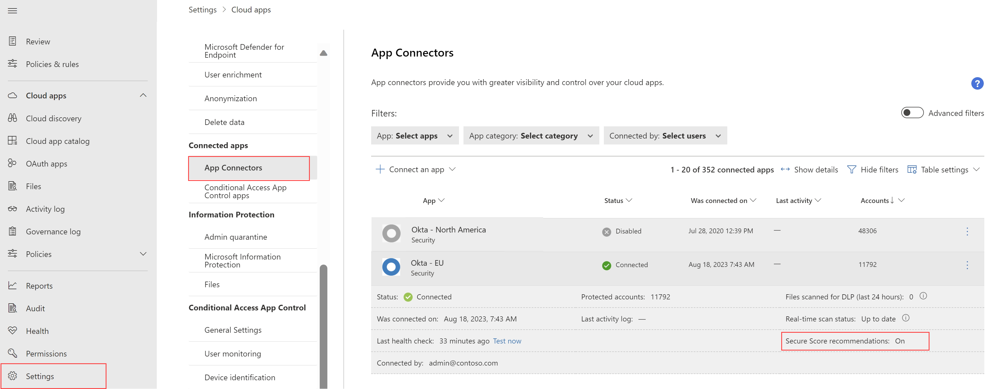
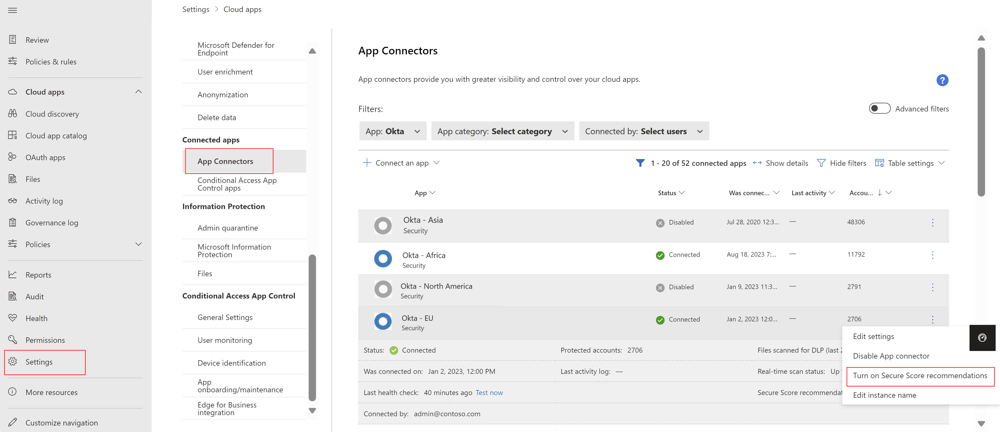

# SaaS security posture management (SSPM)

[!INCLUDE [Banner for top of topics](includes/banner.md)]

Your SaaS application environments may be configured in a risky posture. Microsoft Defender for Cloud Apps provides you with risk security configuration assessments for your SaaS applications to make sure you prevent possible risks. These recommendations are shown via [Microsoft Secure Score](/microsoft-365/security/defender-endpoint/tvm-security-recommendation) once you have a connector to an application.

   

## Prerequisites

Your organization must have Microsoft Defender for Cloud Apps licenses.

## How to enable SaaS apps security posture management

1. Connect the app that you want to manage to Defender for Cloud Apps. For more information, see:

    - [Connect apps to get visibility and control with Microsoft Defender for Cloud Apps](enable-instant-visibility-protection-and-governance-actions-for-your-apps.md)
    - [User, app governance, and security configuration visibility](enable-instant-visibility-protection-and-governance-actions-for-your-apps.md#user-app-governance-and-security-configuration-visibility)

1. After you connected the application via Defender for Cloud Apps, make sure the connector is set to show data in Microsoft Secure Score. To verify it, in the Microsoft Defender Portal, select **Settings** > **Cloud Apps** > **Connected apps** > **App Connectors**. 

1. Open the instance drawer and make sure there is a field **Secure Score insights: Main instance**. For example:

    

    If the instance is not set as the Secure Score main instance, set it by selecting the three dots > **Set as Microsoft Secure Score instance**. For example:

    

## How to manage your SaaS apps security posture

1. The security recommendations will be shown automatically in [Microsoft Secure Score](/microsoft-365/security/defender/microsoft-secure-score). Navigate to the [Microsoft Defender Portal](https://security.microsoft.com). Under the navigation bar, select **Secure score**, and go to **Recommended actions** tab.

    

1. Filter the desired **product** to see its security controls.
1. When selecting the control, you'll find its description and status.
1. To see a step-by-step remediation guide for risky controls, go to the **Implementation** tab in the control side pane.

    

>[!NOTE]
>
> - The recommendations are based on Microsoft benchmarks.
> - Score updates may take up to 24 hours.

## Next steps

> [!div class="nextstepaction"]
> [Control cloud apps with policies](control-cloud-apps-with-policies.md)

[!INCLUDE [Open support ticket](includes/support.md)]

